# 📊 Diagramas de Arquitetura da Informação – Projeto "Censo Fácil"

## Visualização Estrutural dos Sistemas de Organização, Rotulagem e Navegação

---

## 1. DIAGRAMA DE HIERARQUIA DO QUESTIONÁRIO

### 1.1 Estrutura Geral do Questionário

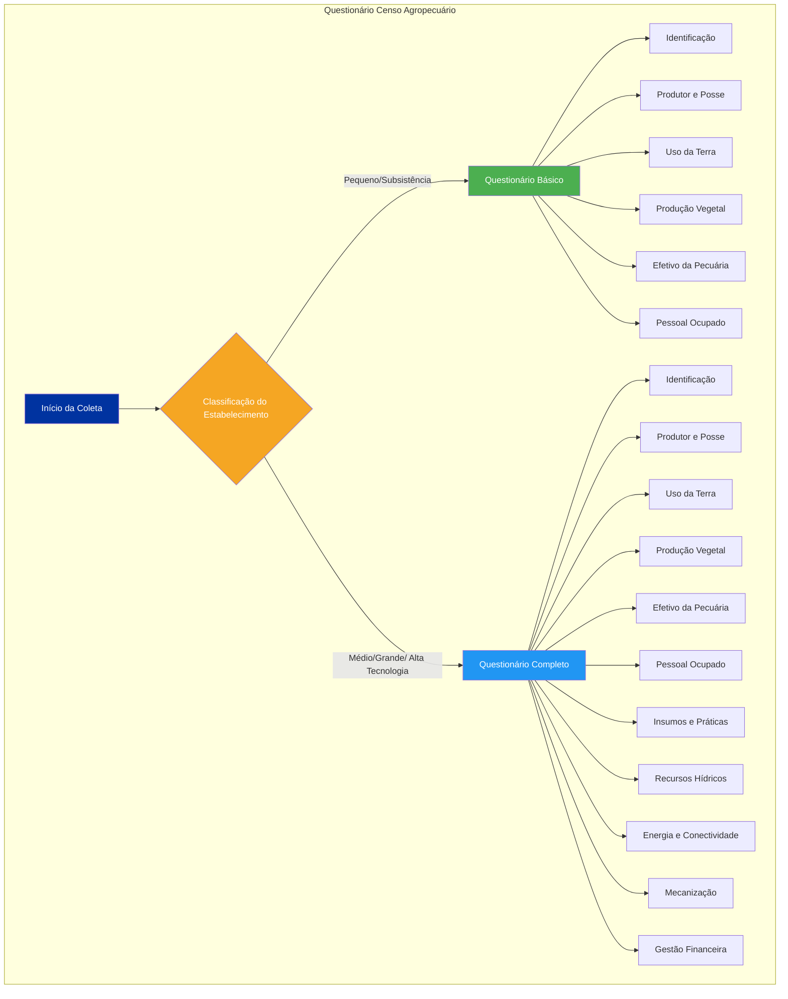

### 1.2 Detalhamento dos Módulos do Questionário Completo

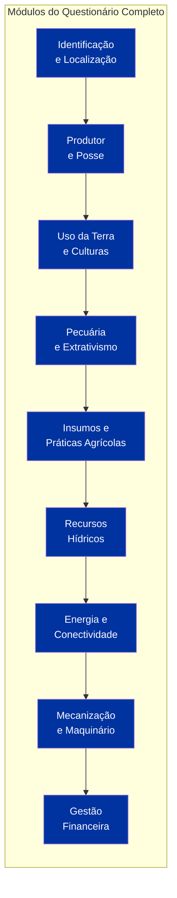

---

## 2. MATRIZ LATCH – ORGANIZAÇÃO DOS DADOS

### 2.1 Diagrama dos 5 Princípios LATCH

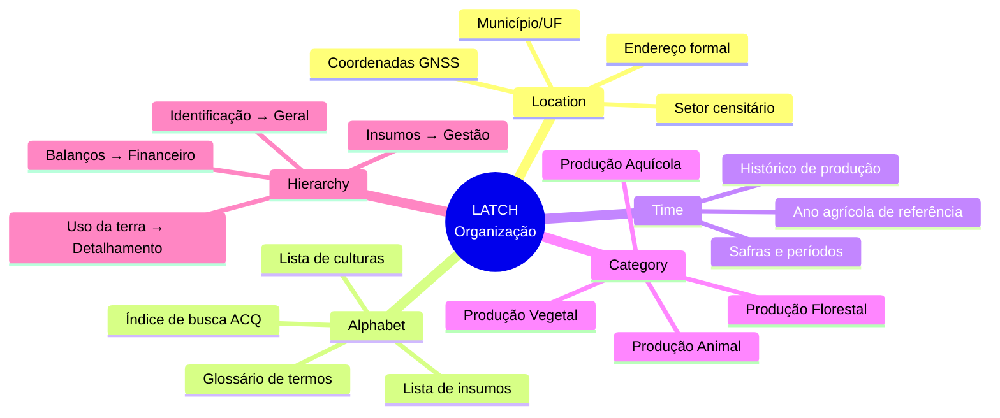

### 2.2 Aplicação Prática do LATCH no Questionário

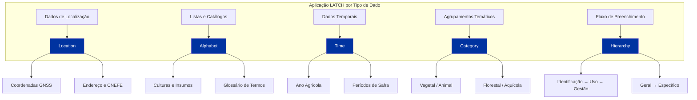

---

## 3. SISTEMA DE ROTULAGEM – TRADUÇÃO PARA LINGUAGEM SIMPLES

### 3.1 Mapeamento de Rótulos Técnicos → Linguagem Simples

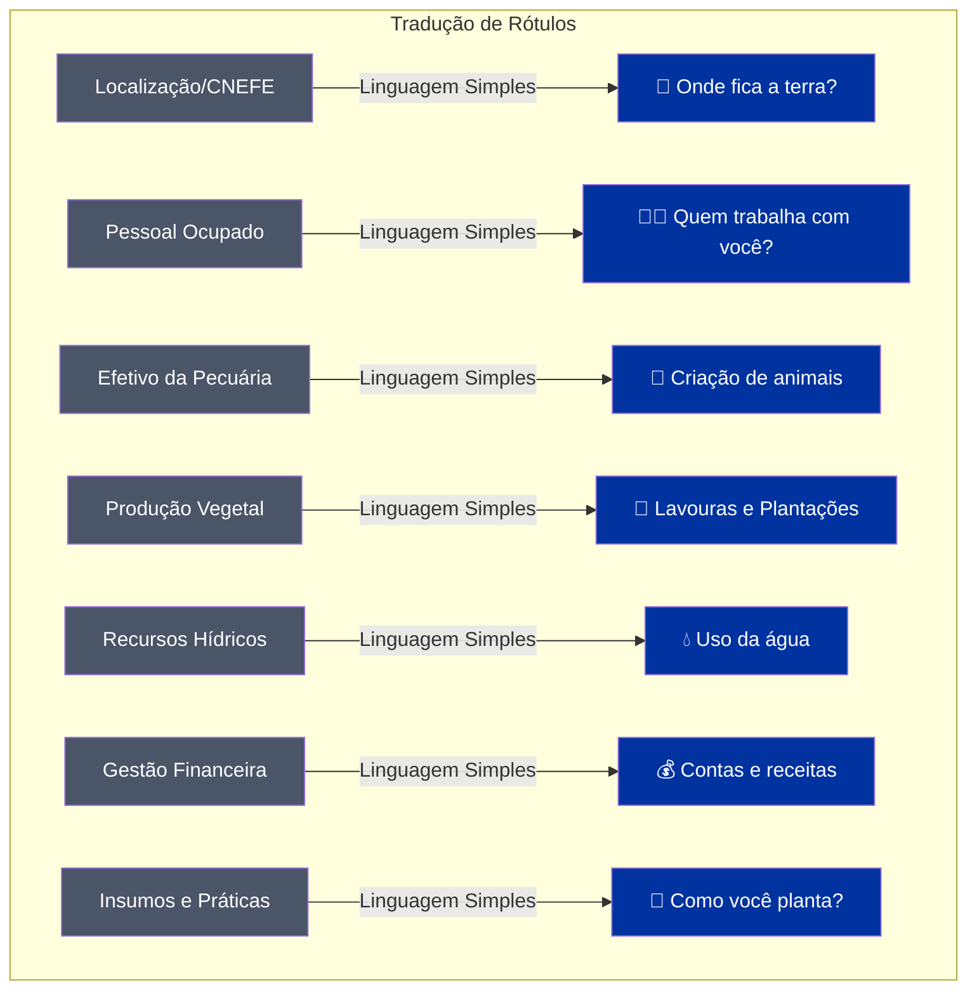

### 3.2 Glossário de Termos Técnicos

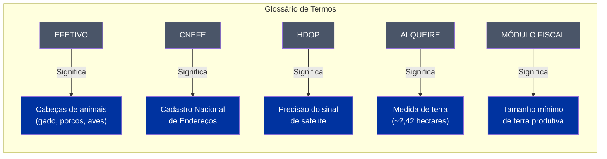

---

## 4. SISTEMA DE NAVEGAÇÃO – FLUXOS E ESTADOS

### 4.1 Navegação Linear (Wizard) – Perfil do Produtor

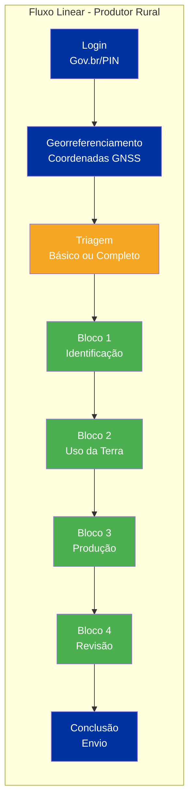

### 4.2 Navegação Não Linear (Menu) – Perfil ACQ

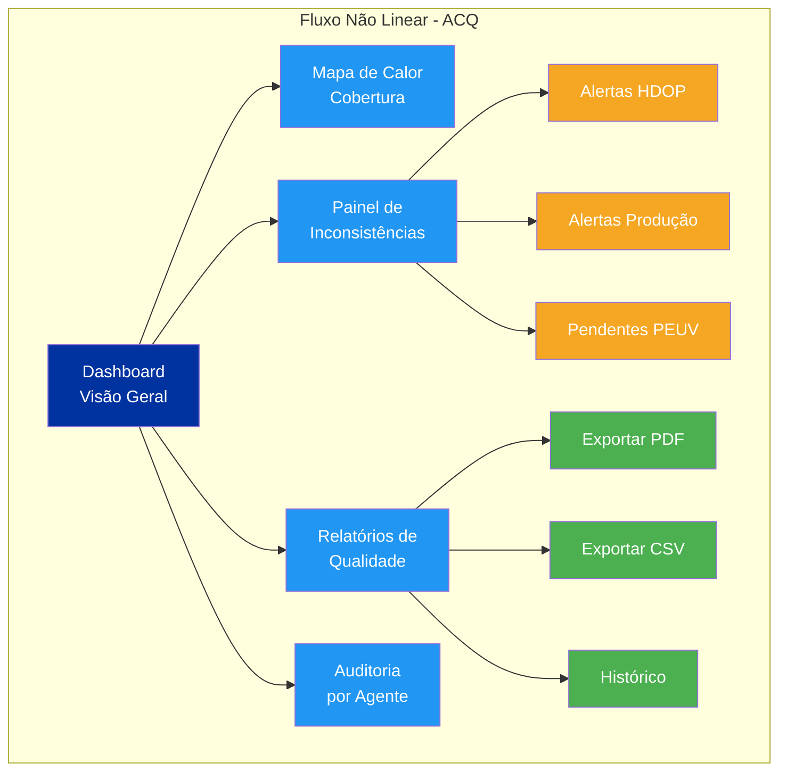

### 4.3 Estados de Conectividade (Online/Offline)

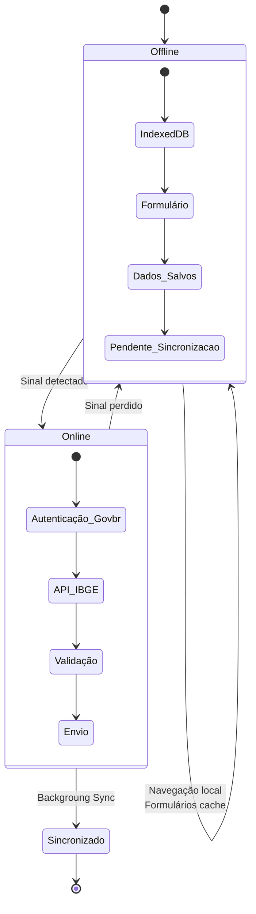

---

## 5. SITEMAP COMPLETO DO CENSO FÁCIL

### 5.1 Estrutura de Telas e Navegação

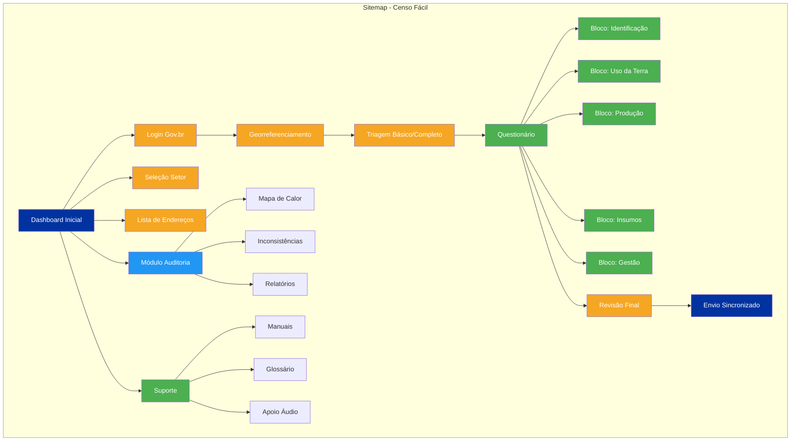

### 5.2 Fluxo de Telas (Wireframe Conceitual)

```mermaid
flowchart TB
    subgraph "Fluxo de Telas por Perfil"
        direction TB
        
        subgraph "Produtor Rural"
            P1[Login] --> P2[Dashboard]
            P2 --> P3[Formulário]
            P3 --> P4[Revisão]
            P4 --> P5[Envio]
        end
        
        subgraph "Recenseador"
            R1[Login] --> R2[Setor]
            R2 --> R3[Lista Endereços]
            R3 --> R4[Coleta]
            R4 --> R5[Sincronização]
        end
        
        subgraph "ACQ"
            A1[Login] --> A2[Dashboard]
            A2 --> A3[Auditoria]
            A3 --> A4[Relatórios]
            A4 --> A5[Validação]
        end
    end
    
    style P1 fill:#0033A0,color:#fff
    style P2 fill:#0033A0,color:#fff
    style P3 fill:#4CAF50,color:#fff
    style P4 fill:#f5a623,color:#fff
    style P5 fill:#0033A0,color:#fff
    
    style R1 fill:#0033A0,color:#fff
    style R2 fill:#0033A0,color:#fff
    style R3 fill:#4CAF50,color:#fff
    style R4 fill:#4CAF50,color:#fff
    style R5 fill:#0033A0,color:#fff
    
    style A1 fill:#0033A0,color:#fff
    style A2 fill:#0033A0,color:#fff
    style A3 fill:#2196F3,color:#fff
    style A4 fill:#2196F3,color:#fff
    style A5 fill:#0033A0,color:#fff
```

---

## 6. DECISÃO DE DESIGN – HIERARQUIA VISUAL

### 6.1 Cores e Identidade Visual

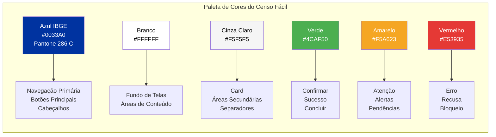

### 6.2 Aplicação da Tipografia Oficial

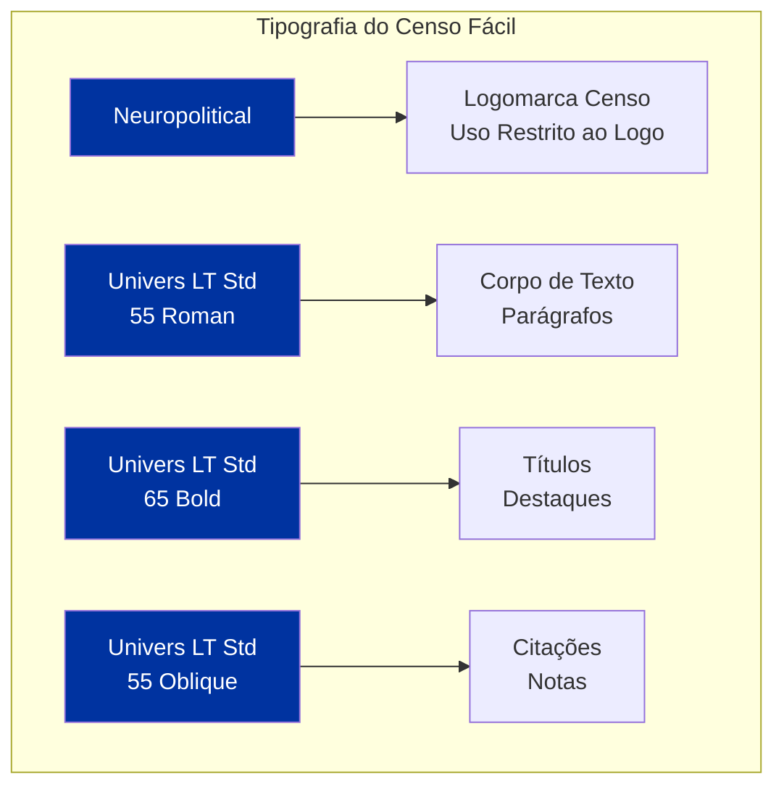

---

## 📌 LEGENDA DOS DIAGRAMAS

| Cor | Significado |
|-----|-------------|
| 🔵 **Azul IBGE (#0033A0)** | Navegação primária, elementos principais, títulos |
| 🟢 **Verde (#4CAF50)** | Confirmar, sucesso, concluir, módulos ativos |
| 🟡 **Amarelo (#F5A623)** | Atenção, alertas, pendências, triagem |
| 🔴 **Vermelho (#E53935)** | Erro, recusa, bloqueio |
| 🔷 **Azul Claro (#2196F3)** | Módulos secundários, auditoria, relatórios |
| ⚪ **Cinza (#4A5568)** | Rótulos técnicos originais |

---

## 💡 COMO UTILIZAR ESTES DIAGRAMAS

| Tipo de Diagrama | Quando Usar | Para Quê |
|------------------|-------------|----------|
| **Hierarquia** | Fase 1 – Estrutura | Entender a relação entre seções do questionário |
| **LATCH** | Fase 1 – Organização | Visualizar como os dados são organizados |
| **Rotulagem** | Fase 2 – UX Writing | Traduzir termos técnicos para linguagem simples |
| **Navegação** | Fase 2 – Prototipagem | Mapear fluxos de tela e transições |
| **Sitemap** | Fase 2 – Arquitetura | Ter visão completa do sistema |
| **Cores/Tipografia** | Fase 2 – Design System | Aplicar identidade visual consistente |

---

*Documento base para a criação dos diagramas de arquitetura da informação do "Censo Fácil". Os diagramas devem ser utilizados como referência durante as fases de design e desenvolvimento.*