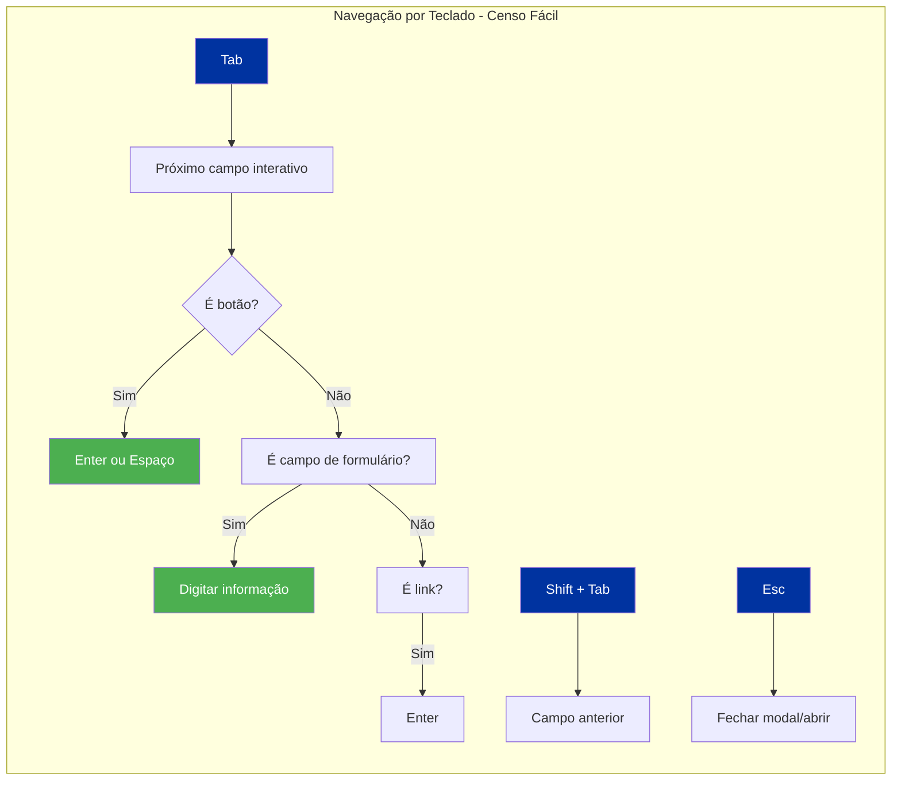
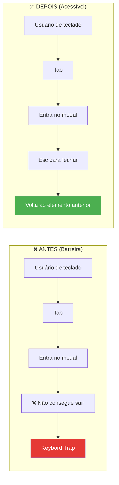
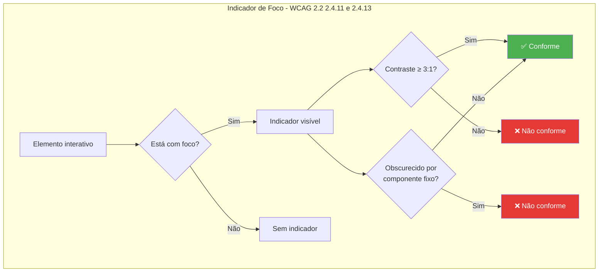
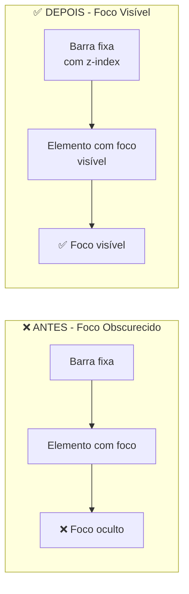
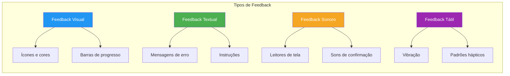
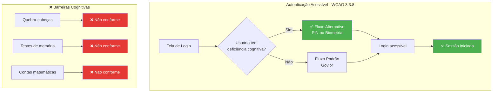
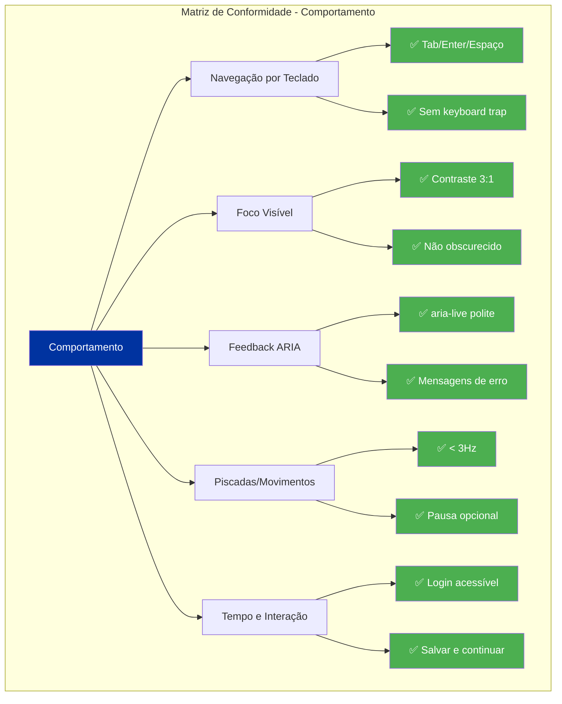

# 🎨 Guia Visual: Ilustrando as Diretrizes de Comportamento (e-MAG + WCAG 2.2)

## Abordagens Práticas para Cada Diretriz

---

## 📌 Estratégia Geral de Visualização

Para cada diretriz de comportamento, recomendo **três formatos complementares**:

| Formato | Quando Usar | Vantagem |
|---------|-------------|----------|
| **Diagrama de Fluxo** | Para processos e sequências | Mostra a jornada do usuário |
| **Comparativo Antes/Depois** | Para demonstrar correções | Evidencia o problema e a solução |
| **Componente Interativo (HTML)** | Para demonstrar funcionamento | Permite testar na prática |

---

## 1. NAVEGAÇÃO POR TECLADO E OPERACIONALIDADE

### 1.1 Diagrama de Fluxo de Navegação por Teclado



### 1.2 Exemplo Interativo (HTML)

```html
<!-- Componente de navegação por teclado -->
<div class="br-card">
  <h3>🔑 Navegação por Teclado - Demonstração</h3>
  
  <div class="demo-container">
    <!-- Ordem de tabulação: 1 → 2 → 3 → 4 -->
    <input type="text" 
           id="campo-1" 
           placeholder="1. Pressione Tab para chegar aqui" 
           class="br-input" />
    
    <button type="button" 
            class="br-button primary" 
            id="btn-1">
      2. Tab + Enter para ativar
    </button>
    
    <a href="#" 
       class="br-link" 
       id="link-1">
      3. Tab + Enter para navegar
    </a>
    
    <select id="select-1" class="br-select">
      <option>4. Tab + Setas para navegar</option>
      <option>Opção 1</option>
      <option>Opção 2</option>
    </select>
  </div>
  
  <div class="br-help-text">
    <p><strong>Teste:</strong> Pressione <kbd>Tab</kbd> para navegar pelos elementos.</p>
    <p><kbd>Shift + Tab</kbd> para voltar.</p>
    <p><kbd>Enter</kbd> ou <kbd>Espaço</kbd> para ativar botões/links.</p>
  </div>
</div>
```

### 1.3 Visual Comparativo: Antes vs. Depois



---

## 2. FOCO VISÍVEL E NÃO OBSCURECIDO

### 2.1 Diagrama de Foco Visível



### 2.2 Visualização de Foco na Tela

```html
<!-- Exemplo de foco visível com Barra Gov.Br -->
<div class="demo-container" style="position:relative;">
  <!-- Barra fixa que não obscurece o foco -->
  <div class="br-bar-fixed" style="position:sticky; top:0; background:#0033A0; color:white; padding:8px; z-index:100;">
    Barra Gov.Br – Fixa
    <span style="font-size:12px; opacity:0.7;">(Não obscurece o foco)</span>
  </div>
  
  <!-- Elementos com foco visível -->
  <div style="padding:20px; margin-top:10px;">
    <button class="br-button primary" 
            style="outline: 3px solid #0033A0; outline-offset: 2px;">
      ✅ Foco visível com contraste
    </button>
    
    <button class="br-button secondary" 
            style="outline: none; box-shadow: 0 0 0 2px #FF0000;">
      ⚠️ Foco visível (contraste mínimo)
    </button>
    
    <button class="br-button danger" 
            style="outline: none; box-shadow: none;">
      ❌ Foco invisível (não conforme)
    </button>
  </div>
  
  <!-- Comentário visual -->
  <div class="br-help-text" style="margin-top:10px;">
    <p><strong>Legenda:</strong></p>
    <p>✅ Azul (#0033A0) – Contraste ≥ 3:1 contra fundo branco</p>
    <p>⚠️ Vermelho – Contraste mínimo (3:1)</p>
    <p>❌ Sem indicador – Não conforme com WCAG 2.4.13</p>
  </div>
</div>
```

### 2.3 Comparativo: Foco Obscurecido vs. Não Obscurecido



---

## 3. FEEDBACK DE AÇÕES E REGIÕES VIVAS

### 3.1 Diagrama de Feedback com ARIA

```mermaid
flowchart TD
    subgraph "Região Viva - aria-live"
        A[Usuário realiza ação] --> B[Sistema processa]
        B --> C{Atualização na tela}
        
        C --> D[aria-live="polite"]
        C --> E[aria-live="assertive"]
        
        D --> F[Aguardar conclusão<br/>da interação atual]
        E --> G[Interromper e<br/>anunciar imediatamente]
        
        F --> H[Leitor de tela<br/>anuncia atualização]
        G --> H
        
        H --> I[Usuário recebe feedback]
    end
    
    style D fill:#4CAF50,color:#fff
    style E fill:#F5A623,color:#fff
    style I fill:#0033A0,color:#fff
```

### 3.2 Exemplo: Componente GNSS com Feedback

```html
<!-- Componente br-gnss-tracker com feedback -->
<div class="br-card" role="region" aria-labelledby="gnss-feedback">
  <h3 id="gnss-feedback">📡 Captura de Coordenadas</h3>
  
  <!-- Status atual - região viva -->
  <div aria-live="polite" aria-atomic="true" class="gnss-status">
    <span id="status-hdop" 
          class="status-indicator status-ok"
          role="status">
      ✅ Precisão ótima (HDOP: 2.1)
    </span>
  </div>
  
  <!-- Barra de progresso -->
  <div role="progressbar" 
       aria-valuenow="85" 
       aria-valuemin="0" 
       aria-valuemax="100"
       class="progress-bar"
       aria-label="Progresso da captura de sinal">
    <span class="progress-fill" style="width:85%;"></span>
    <span class="progress-text">85%</span>
  </div>
  
  <!-- Mensagem de erro com feedback -->
  <div role="alert" 
       aria-live="assertive" 
       class="br-alert danger" 
       hidden="hidden">
    <span class="br-alert-icon">⚠️</span>
    <span class="br-alert-message">
      Sinal GNSS fraco (HDOP: 12.5). Mova-se para uma área aberta.
    </span>
  </div>
  
  <button type="button" 
          class="br-button primary" 
          id="btn-capturar"
          aria-label="Iniciar captura de coordenadas">
    📡 Capturar
  </button>
</div>
```

### 3.3 Visualização de Feedback por Tipo



---

## 4. CONTROLE DE PISCADAS, MOVIMENTOS E ANIMAÇÕES

### 4.1 Diagrama de Verificação de Piscadas

```mermaid
flowchart TD
    subgraph "Verificação de Conteúdo Dinâmico"
        A[Conteúdo dinâmico] --> B{É uma animação?}
        B -->|Sim| C{Frequência > 3Hz?}
        C -->|Sim| D[❌ Não conforme<br/>(risco de convulsões)]
        C -->|Não| E[✅ Conforme]
        
        B -->|Não| F{É movimento?}
        F -->|Sim| G{Pode ser pausado?}
        G -->|Não| H[❌ Não conforme]
        G -->|Sim| I[✅ Conforme]
        
        F -->|Não| J[✅ Conforme]
    end
    
    style D fill:#E53935,color:#fff
    style H fill:#E53935,color:#fff
    style E fill:#4CAF50,color:#fff
    style I fill:#4CAF50,color:#fff
    style J fill:#4CAF50,color:#fff
```

### 4.2 Exemplo: Controle de Animações

```html
<!-- Controle de animações com prefers-reduced-motion -->
<div class="br-card">
  <h3>🎬 Controle de Animações</h3>
  
  <!-- Animação segura -->
  <div class="safe-animation" 
       style="transition: transform 0.3s ease-in-out;">
    <span>✅ Animação lenta (0.3s)</span>
  </div>
  
  <!-- Animação com preferência de redução -->
  <div class="reduced-motion" 
       style="transition: transform 0.1s ease-in-out;"
       aria-label="Animação com redução de movimento">
    <span>🔄 Animação reduzida (0.1s)</span>
  </div>
  
  <!-- Controle de pausa -->
  <div class="animation-control">
    <div id="animacao-exemplo" 
         style="width:100px; height:100px; background:#0033A0; 
                transition: all 0.5s;">
      <!-- Elemento animado -->
    </div>
    
    <button type="button" 
            class="br-button secondary" 
            id="btn-pausar-animacao"
            aria-label="Pausar animação">
      ⏸️ Pausar
    </button>
  </div>
  
  <div class="br-help-text">
    <p><strong>Regras:</strong></p>
    <ul>
      <li>Animações ≤ 3Hz (seguro para epiléticos)</li>
      <li>Opção de pausar ou desativar animações</li>
      <li>Respeita <code>prefers-reduced-motion</code></li>
    </ul>
  </div>
</div>

<style>
  /* CSS para prefers-reduced-motion */
  @media (prefers-reduced-motion: reduce) {
    .safe-animation {
      transition-duration: 0.01s !important;
    }
    .reduced-motion {
      transition-duration: 0.01s !important;
    }
  }
</style>
```

---

## 5. GESTÃO DE TEMPO E INTERAÇÃO

### 5.1 Diagrama de Autenticação Acessível



### 5.2 Exemplo: "Salvar e Continuar Depois"

```html
<!-- Funcionalidade de persistência -->
<div class="br-card">
  <h3>💾 Persistência de Dados</h3>
  
  <div class="form-progress">
    <span class="progress-label">Progresso: 45%</span>
    <div role="progressbar" 
         aria-valuenow="45" 
         aria-valuemin="0" 
         aria-valuemax="100"
         class="progress-bar"
         aria-label="Progresso do formulário">
      <span class="progress-fill" style="width:45%;"></span>
    </div>
  </div>
  
  <div class="form-actions">
    <button type="button" 
            class="br-button primary" 
            id="btn-salvar"
            aria-label="Salvar e continuar depois">
      💾 Salvar e continuar depois
    </button>
    
    <button type="button" 
            class="br-button secondary" 
            id="btn-continuar">
      ➡️ Continuar
    </button>
  </div>
  
  <div class="br-help-text">
    <p><strong>Como funciona:</strong></p>
    <ul>
      <li>Dados salvos localmente no IndexedDB</li>
      <li>Criptografados com AES-256 (LGPD)</li>
      <li>Recuperação automática ao retornar</li>
      <li>Nenhuma perda de informação em caso de queda de conexão</li>
    </ul>
  </div>
</div>
```

---

## 📊 RESUMO VISUAL: MATRIZ DE CONFORMIDADE DE COMPORTAMENTO



---

## 📚 Resumo: Ferramentas para Ilustrar Diretrizes

| Formato | Ferramenta | Melhor para |
|---------|------------|-------------|
| **Diagramas** | Mermaid, Draw.io, Lucidchart | Fluxos, processos, hierarquias |
| **Comparativos** | Figma, PowerPoint, Canva | Antes vs. Depois |
| **Componentes HTML** | CodePen, JSFiddle, StackBlitz | Demonstração interativa |
| **Prototipagem** | Figma, Adobe XD | Simulação de interações |
| **Vídeo** | Loom, ScreenPal | Demonstração guiada |

---

*Este guia serve como referência visual para a auditoria de comportamento do "Censo Fácil", ilustrando cada diretriz do e-MAG 3.1 e WCAG 2.2 de forma clara e prática.*