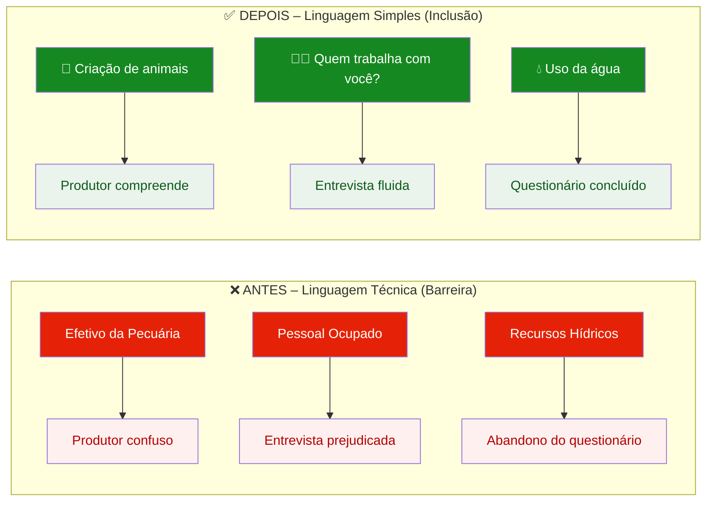
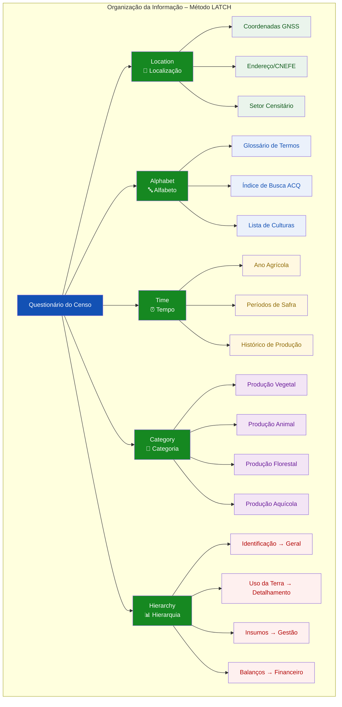
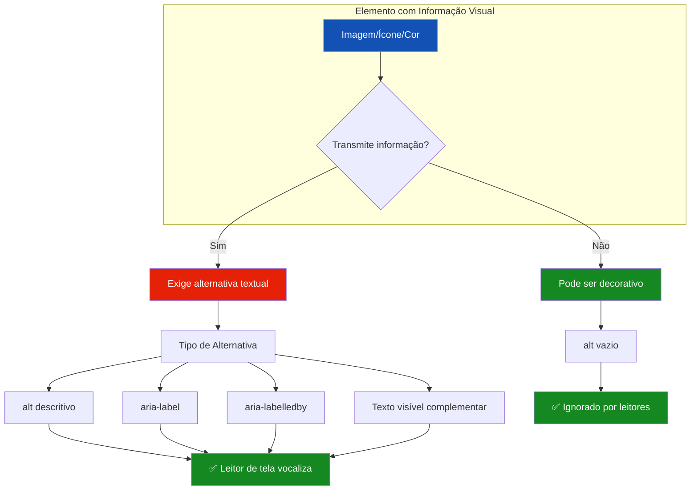
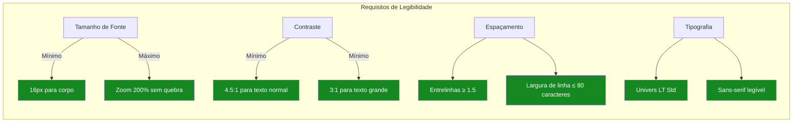
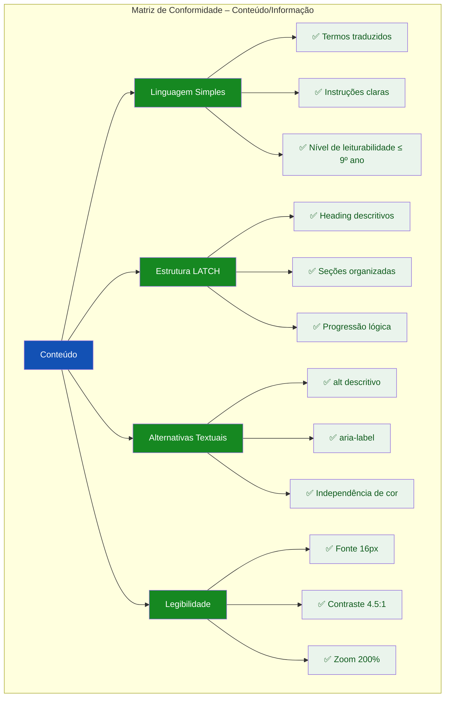

# 🎨 Guia Visual: Ilustrando as Diretrizes de Conteúdo/Informação (e-MAG 3.1)

## Abordagens Práticas para a TASK-F1-UX-003.3

---

## 📌 Estratégia Geral de Visualização

Para a **Área de Conteúdo/Informação do e-MAG 3.1**, recomendo **quatro formatos complementares** que dialogam diretamente com as personas do "Censo Fácil":

| Formato | Quando Usar | Melhor para |
|---------|-------------|-------------|
| **Comparativo Antes/Depois** | Demonstrar tradução de linguagem técnica | Linguagem Simples e UX Writing |
| **Diagrama de Hierarquia** | Mostrar estrutura e organização | Método LATCH e Headings |
| **Cards de Componente** | Ilustrar alternativas textuais | Imagens, ícones e links contextuais |
| **Exemplo de Contraste** | Demonstrar legibilidade | Tipografia e acessibilidade visual |

---

## 1. LINGUAGEM SIMPLES – TRADUÇÃO DE TERMOS TÉCNICOS

### 1.1 Comparativo Antes/Depois (Recomendação Principal)



### 1.2 Exemplo Interativo (HTML) – Cards de Tradução

```html
<!-- Cards de Tradução de Termos Técnicos -->
<div class="card" style="margin-bottom:1.5rem;">
  <h3 style="font-size:0.8rem; font-weight:600; text-transform:uppercase; letter-spacing:0.05em; color:#1351B4; margin-bottom:1rem;">🔤 Tradução de Termos Técnicos</h3>
  
  <div class="grid-2">
    <!-- Termo 1 -->
    <div style="border:1px solid #C5D4EB; border-radius:8px; padding:1rem; background:#FFFFFF;">
      <div style="display:flex; align-items:center; gap:0.5rem; margin-bottom:0.5rem;">
        <span style="background:#E52207; color:#FFFFFF; padding:0.125rem 0.5rem; border-radius:4px; font-size:0.6rem; font-weight:600;">TÉCNICO</span>
        <span style="font-family:'JetBrains Mono',monospace; font-size:0.875rem;">Efetivo da Pecuária</span>
      </div>
      <div style="display:flex; align-items:center; gap:0.5rem; margin-bottom:0.5rem;">
        <span style="background:#168821; color:#FFFFFF; padding:0.125rem 0.5rem; border-radius:4px; font-size:0.6rem; font-weight:600;">SIMPLES</span>
        <span style="font-size:1rem; font-weight:600; color:#168821;">🐄 Criação de animais</span>
      </div>
      <div style="font-size:0.75rem; color:#555770; margin-top:0.25rem;">
        ✅ Compreensão imediata pelo produtor rural
      </div>
    </div>
    
    <!-- Termo 2 -->
    <div style="border:1px solid #C5D4EB; border-radius:8px; padding:1rem; background:#FFFFFF;">
      <div style="display:flex; align-items:center; gap:0.5rem; margin-bottom:0.5rem;">
        <span style="background:#E52207; color:#FFFFFF; padding:0.125rem 0.5rem; border-radius:4px; font-size:0.6rem; font-weight:600;">TÉCNICO</span>
        <span style="font-family:'JetBrains Mono',monospace; font-size:0.875rem;">Pessoal Ocupado</span>
      </div>
      <div style="display:flex; align-items:center; gap:0.5rem; margin-bottom:0.5rem;">
        <span style="background:#168821; color:#FFFFFF; padding:0.125rem 0.5rem; border-radius:4px; font-size:0.6rem; font-weight:600;">SIMPLES</span>
        <span style="font-size:1rem; font-weight:600; color:#168821;">👨‍🌾 Quem trabalha com você?</span>
      </div>
      <div style="font-size:0.75rem; color:#555770; margin-top:0.25rem;">
        ✅ Foco na relação interpessoal da agricultura familiar
      </div>
    </div>
    
    <!-- Termo 3 -->
    <div style="border:1px solid #C5D4EB; border-radius:8px; padding:1rem; background:#FFFFFF;">
      <div style="display:flex; align-items:center; gap:0.5rem; margin-bottom:0.5rem;">
        <span style="background:#E52207; color:#FFFFFF; padding:0.125rem 0.5rem; border-radius:4px; font-size:0.6rem; font-weight:600;">TÉCNICO</span>
        <span style="font-family:'JetBrains Mono',monospace; font-size:0.875rem;">Recursos Hídricos</span>
      </div>
      <div style="display:flex; align-items:center; gap:0.5rem; margin-bottom:0.5rem;">
        <span style="background:#168821; color:#FFFFFF; padding:0.125rem 0.5rem; border-radius:4px; font-size:0.6rem; font-weight:600;">SIMPLES</span>
        <span style="font-size:1rem; font-weight:600; color:#168821;">💧 Uso da água</span>
      </div>
      <div style="font-size:0.75rem; color:#555770; margin-top:0.25rem;">
        ✅ Identificação imediata do tema
      </div>
    </div>
    
    <!-- Termo 4 -->
    <div style="border:1px solid #C5D4EB; border-radius:8px; padding:1rem; background:#FFFFFF;">
      <div style="display:flex; align-items:center; gap:0.5rem; margin-bottom:0.5rem;">
        <span style="background:#E52207; color:#FFFFFF; padding:0.125rem 0.5rem; border-radius:4px; font-size:0.6rem; font-weight:600;">TÉCNICO</span>
        <span style="font-family:'JetBrains Mono',monospace; font-size:0.875rem;">Produção Vegetal</span>
      </div>
      <div style="display:flex; align-items:center; gap:0.5rem; margin-bottom:0.5rem;">
        <span style="background:#168821; color:#FFFFFF; padding:0.125rem 0.5rem; border-radius:4px; font-size:0.6rem; font-weight:600;">SIMPLES</span>
        <span style="font-size:1rem; font-weight:600; color:#168821;">🌱 Lavouras e Plantações</span>
      </div>
      <div style="font-size:0.75rem; color:#555770; margin-top:0.25rem;">
        ✅ Correspondência com o mundo real do produtor
      </div>
    </div>
  </div>
</div>
```

---

## 2. ESTRUTURA E ORGANIZAÇÃO – MÉTODO LATCH

### 2.1 Diagrama de Hierarquia LATCH



### 2.2 Exemplo Interativo – Seções com Headings Descritivos

```html
<!-- Hierarquia de Títulos com Ícones -->
<div class="card" style="margin-bottom:1.5rem;">
  <h3 style="font-size:0.8rem; font-weight:600; text-transform:uppercase; letter-spacing:0.05em; color:#1351B4; margin-bottom:1rem;">📋 Hierarquia de Headings Descritivos</h3>
  
  <div style="border:1px solid #C5D4EB; border-radius:8px; padding:1rem; background:#F8FAFC;">
    <!-- H1 -->
    <div style="display:flex; align-items:center; gap:0.5rem; margin-bottom:1rem; padding-bottom:0.5rem; border-bottom:2px solid #1351B4;">
      <span style="background:#1351B4; color:#FFFFFF; padding:0.125rem 0.5rem; border-radius:4px; font-size:0.6rem; font-weight:700;">H1</span>
      <span style="font-size:1.25rem; font-weight:700; color:#071D41;">Censo Agropecuário 2026</span>
    </div>
    
    <!-- H2 com ícone -->
    <div style="display:flex; align-items:center; gap:0.5rem; margin-bottom:0.5rem; margin-left:1rem;">
      <span style="background:#1351B4; color:#FFFFFF; padding:0.125rem 0.5rem; border-radius:4px; font-size:0.6rem; font-weight:700;">H2</span>
      <span style="font-size:1.5rem;">📍</span>
      <span style="font-size:1rem; font-weight:600; color:#071D41;">Onde fica a terra?</span>
      <span style="font-size:0.65rem; color:#555770; margin-left:0.5rem;">(Localização/CNEFE)</span>
    </div>
    
    <!-- H3 -->
    <div style="display:flex; align-items:center; gap:0.5rem; margin-bottom:0.5rem; margin-left:2rem;">
      <span style="background:#1351B4; color:#FFFFFF; padding:0.125rem 0.5rem; border-radius:4px; font-size:0.6rem; font-weight:700;">H3</span>
      <span style="font-size:1rem; font-weight:500; color:#1C1C1E;">Coordenadas do estabelecimento</span>
    </div>
    
    <!-- H4 -->
    <div style="display:flex; align-items:center; gap:0.5rem; margin-bottom:0.5rem; margin-left:3rem;">
      <span style="background:#1351B4; color:#FFFFFF; padding:0.125rem 0.5rem; border-radius:4px; font-size:0.6rem; font-weight:700;">H4</span>
      <span style="font-size:0.875rem; color:#555770;">Precisão do sinal GNSS (HDOP)</span>
    </div>
    
    <!-- Outro H2 -->
    <div style="display:flex; align-items:center; gap:0.5rem; margin-top:0.75rem; padding-top:0.5rem; border-top:1px dashed #C5D4EB; margin-left:1rem;">
      <span style="background:#1351B4; color:#FFFFFF; padding:0.125rem 0.5rem; border-radius:4px; font-size:0.6rem; font-weight:700;">H2</span>
      <span style="font-size:1.5rem;">🐄</span>
      <span style="font-size:1rem; font-weight:600; color:#071D41;">Criação de animais</span>
      <span style="font-size:0.65rem; color:#555770; margin-left:0.5rem;">(Efetivo da Pecuária)</span>
    </div>
  </div>
  
  <div style="margin-top:0.75rem; padding:0.5rem 0.75rem; background:#EAF4EC; border-radius:4px; font-size:0.75rem; color:#0D5A1B;">
    ✅ Hierarquia sem saltos: H1 → H2 → H3 → H4. Cada seção com heading descritivo e ícone.
  </div>
</div>
```

---

## 3. ALTERNATIVAS TEXTUAIS E INDEPENDÊNCIA DE COR

### 3.1 Diagrama de Alternativas Textuais



### 3.2 Exemplo Interativo – Componente GNSS com Alternativas

```html
<!-- Componente GNSS com Alternativas Textuais -->
<div class="card" style="margin-bottom:1.5rem;">
  <h3 style="font-size:0.8rem; font-weight:600; text-transform:uppercase; letter-spacing:0.05em; color:#1351B4; margin-bottom:1rem;">📡 Status GNSS – Alternativas Textuais</h3>
  
  <div style="display:grid; grid-template-columns:1fr 1fr 1fr; gap:1rem;">
    <!-- Status Ótimo -->
    <div style="border:1px solid #168821; border-radius:8px; padding:1rem; background:#EAF4EC; text-align:center;">
      <div style="font-size:2.5rem; margin-bottom:0.25rem;">✅</div>
      <div style="display:flex; justify-content:center; gap:0.5rem; align-items:center; flex-wrap:wrap;">
        <span style="background:#168821; color:#FFFFFF; padding:0.125rem 0.5rem; border-radius:12px; font-size:0.6rem; font-weight:600;">COR</span>
        <span style="width:1.5rem; height:1.5rem; background:#168821; border-radius:50%; display:inline-block;"></span>
      </div>
      <div style="font-weight:600; font-size:1rem; color:#168821;">Ótima</div>
      <div style="font-size:0.75rem; color:#555770;">HDOP: 2.1</div>
      <div style="margin-top:0.5rem; font-size:0.65rem; background:#FFFFFF; padding:0.25rem; border-radius:4px; border:1px solid #C5D4EB;">
        <code style="font-size:0.6rem;">aria-label="Precisão ótima, HDOP 2.1"</code>
      </div>
    </div>
    
    <!-- Status Aceitável -->
    <div style="border:1px solid #916A00; border-radius:8px; padding:1rem; background:#FFF8E1; text-align:center;">
      <div style="font-size:2.5rem; margin-bottom:0.25rem;">⚠️</div>
      <div style="display:flex; justify-content:center; gap:0.5rem; align-items:center; flex-wrap:wrap;">
        <span style="background:#916A00; color:#FFFFFF; padding:0.125rem 0.5rem; border-radius:12px; font-size:0.6rem; font-weight:600;">COR</span>
        <span style="width:1.5rem; height:1.5rem; background:#F5A623; border-radius:50%; display:inline-block;"></span>
      </div>
      <div style="font-weight:600; font-size:1rem; color:#916A00;">Aceitável</div>
      <div style="font-size:0.75rem; color:#555770;">HDOP: 7.3</div>
      <div style="margin-top:0.5rem; font-size:0.65rem; background:#FFFFFF; padding:0.25rem; border-radius:4px; border:1px solid #C5D4EB;">
        <code style="font-size:0.6rem;">aria-label="Precisão aceitável, HDOP 7.3"</code>
      </div>
    </div>
    
    <!-- Status Insuficiente -->
    <div style="border:1px solid #E52207; border-radius:8px; padding:1rem; background:#FEF0EF; text-align:center;">
      <div style="font-size:2.5rem; margin-bottom:0.25rem;">⛔</div>
      <div style="display:flex; justify-content:center; gap:0.5rem; align-items:center; flex-wrap:wrap;">
        <span style="background:#E52207; color:#FFFFFF; padding:0.125rem 0.5rem; border-radius:12px; font-size:0.6rem; font-weight:600;">COR</span>
        <span style="width:1.5rem; height:1.5rem; background:#E52207; border-radius:50%; display:inline-block;"></span>
      </div>
      <div style="font-weight:600; font-size:1rem; color:#E52207;">Bloqueado</div>
      <div style="font-size:0.75rem; color:#555770;">HDOP: 12.5</div>
      <div style="margin-top:0.5rem; font-size:0.65rem; background:#FFFFFF; padding:0.25rem; border-radius:4px; border:1px solid #C5D4EB;">
        <code style="font-size:0.6rem;">aria-label="Precisão insuficiente, HDOP 12.5"</code>
      </div>
    </div>
  </div>
  
  <div style="margin-top:0.75rem; padding:0.5rem 0.75rem; background:#EBF1FB; border-radius:4px; font-size:0.75rem; color:#1351B4;">
    ✅ Independência de cor: status acompanhado por texto e ícone. Alternativas textuais via <code>aria-label</code>.
  </div>
</div>
```

---

## 4. LEGIBILIDADE E APRESENTAÇÃO

### 4.1 Diagrama de Legibilidade



### 4.2 Exemplo Interativo – Demonstração de Contraste

```html
<!-- Demonstração de Contraste -->
<div class="card">
  <h3 style="font-size:0.8rem; font-weight:600; text-transform:uppercase; letter-spacing:0.05em; color:#1351B4; margin-bottom:1rem;">🎨 Demonstração de Contraste (4.5:1)</h3>
  
  <div class="grid-2">
    <!-- Contraste Suficiente -->
    <div style="border:1px solid #168821; border-radius:8px; padding:1rem; background:#FFFFFF;">
      <div style="font-size:0.75rem; font-weight:600; color:#168821; margin-bottom:0.5rem;">✅ Contraste Suficiente (≥ 4.5:1)</div>
      <div style="background:#071D41; padding:1rem; border-radius:4px;">
        <p style="color:#FFFFFF; font-size:1rem; font-weight:400; margin:0;">
          Texto com contraste adequado
        </p>
      </div>
      <div style="margin-top:0.5rem; font-size:0.65rem; color:#555770; font-family:'JetBrains Mono',monospace;">
        Fundo: #071D41 · Texto: #FFFFFF · Razão: 15.8:1
      </div>
    </div>
    
    <!-- Contraste Insuficiente -->
    <div style="border:1px solid #E52207; border-radius:8px; padding:1rem; background:#FFFFFF;">
      <div style="font-size:0.75rem; font-weight:600; color:#E52207; margin-bottom:0.5rem;">❌ Contraste Insuficiente (&lt; 4.5:1)</div>
      <div style="background:#93B8E8; padding:1rem; border-radius:4px;">
        <p style="color:#071D41; font-size:1rem; font-weight:400; margin:0;">
          Texto com contraste inadequado
        </p>
      </div>
      <div style="margin-top:0.5rem; font-size:0.65rem; color:#555770; font-family:'JetBrains Mono',monospace;">
        Fundo: #93B8E8 · Texto: #071D41 · Razão: 2.8:1
      </div>
    </div>
  </div>
  
  <div style="margin-top:0.75rem; padding:0.5rem 0.75rem; background:#EAF4EC; border-radius:4px; font-size:0.75rem; color:#0D5A1B;">
    ✅ Contraste mínimo de 4.5:1 para textos, garantindo legibilidade sob luz solar intensa.
  </div>
</div>
```

---

## 5. RESUMO VISUAL: CHECKLIST DE CONTEÚDO/INFORMAÇÃO



---

## 📚 Resumo: Ferramentas para Ilustrar Diretrizes de Conteúdo

| Formato | Ferramenta | Melhor para |
|---------|------------|-------------|
| **Comparativo** | Mermaid, Figma, Canva | Linguagem Simples (Antes/Depois) |
| **Diagrama Hierárquico** | Mermaid, Draw.io | LATCH, Headings |
| **Cards de Componente** | HTML/CSS, Figma | Alternativas textuais, acessibilidade |
| **Demonstração de Contraste** | HTML/CSS, WebAIM | Legibilidade e apresentação |
| **Checklist Visual** | Mermaid, Notion, Miro | Matriz de conformidade |

---

## 💡 Recomendações de Implementação

| Diretriz | Forma de Ilustrar no Projeto |
|----------|------------------------------|
| **Linguagem Simples** | Cards comparativos com versão técnica vs. traduzida, destacando a mudança |
| **Estrutura LATCH** | Diagrama de árvore mostrando a organização dos dados |
| **Headings Descritivos** | Exemplo de formulário com ícones e títulos claros |
| **Alternativas Textuais** | Componente GNSS com `aria-label` visível e explicado |
| **Independência de Cor** | Três cards de status (verde/amarelo/vermelho) com texto complementar |
| **Legibilidade** | Exemplo de contraste e tamanho de fonte em contexto de campo |

---

*Este guia serve como referência visual para a auditoria de Conteúdo/Informação do "Censo Fácil", ilustrando cada diretriz do e-MAG 3.1 de forma clara e prática para a TASK-F1-UX-003.3.*