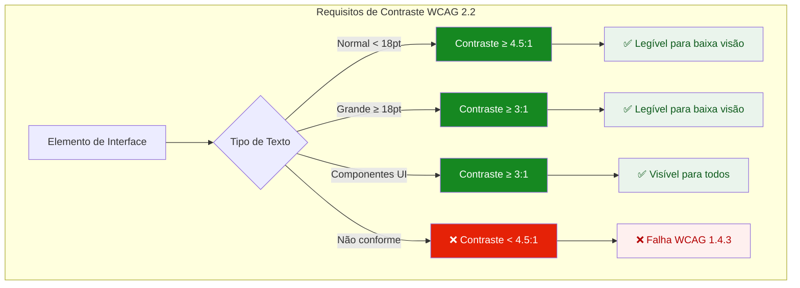
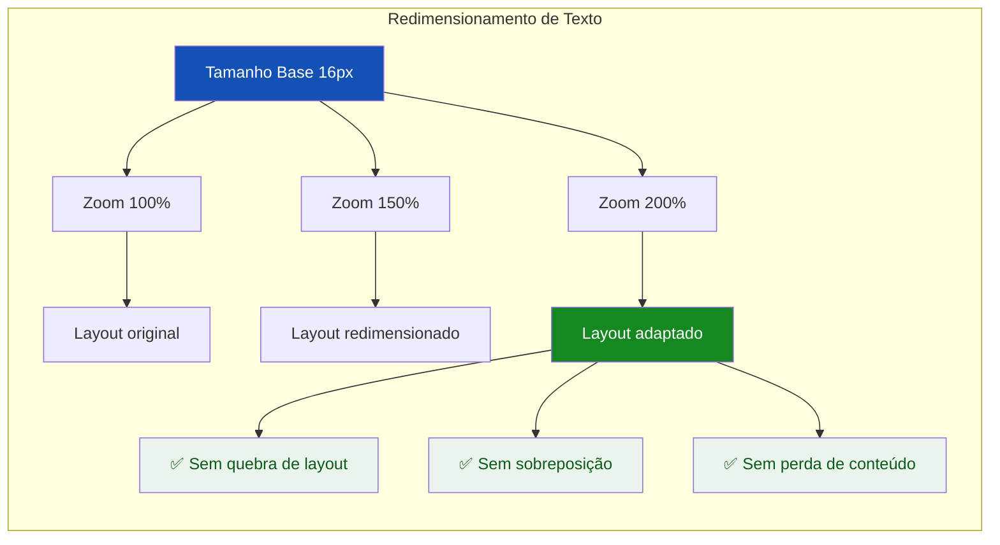
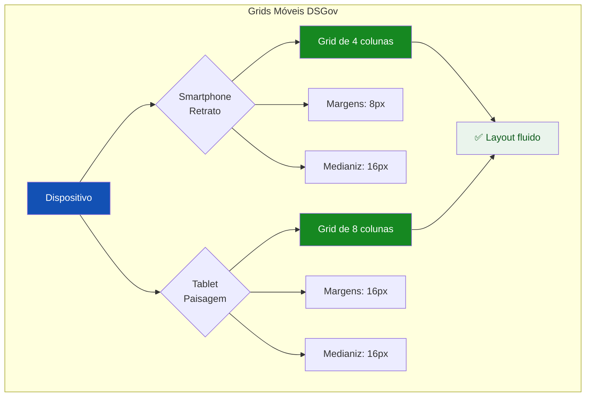
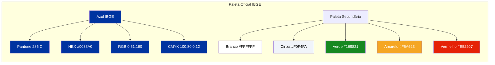
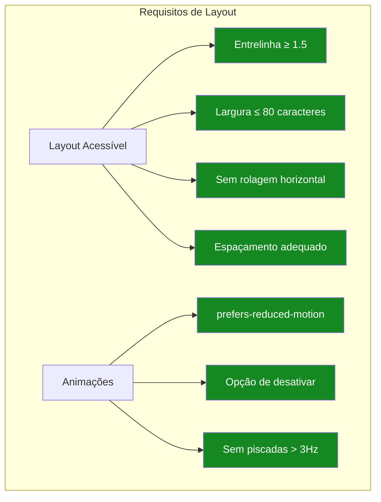
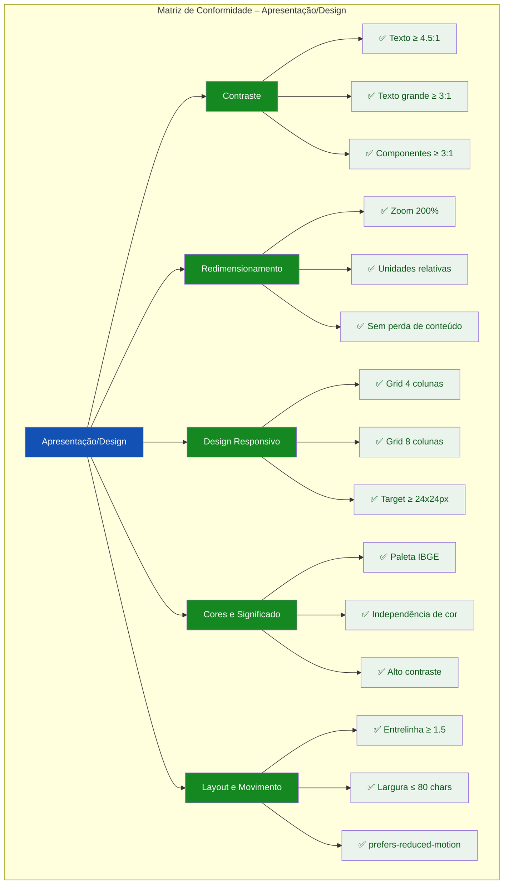

# 🎨 Guia Visual: Ilustrando as Diretrizes de Apresentação/Design (e-MAG 3.1)

## Abordagens Práticas para a TASK-F1-UX-003.4

---

## 📌 Estratégia Geral de Visualização

Para a **Área de Apresentação/Design do e-MAG 3.1** combinada com o **Manual de Identidade Visual do IBGE**, recomendo **cinco formatos complementares**:

| Formato | Quando Usar | Melhor para |
|---------|-------------|-------------|
| **Comparativo de Contraste** | Demonstrar legibilidade em campo | Contraste e acessibilidade visual |
| **Demonstração de Redimensionamento** | Mostrar flexibilidade do layout | Zoom 200% e unidades relativas |
| **Layout Responsivo** | Ilustrar adaptação a dispositivos | Grids móveis e alvos de toque |
| **Paleta de Cores Institucional** | Validar identidade visual | Azul IBGE e independência de cor |
| **Checklist Visual** | Consolidar conformidade | Matriz de auditoria |

---

## 1. CONTRASTE E LEGIBILIDADE

### 1.1 Diagrama de Contraste (WCAG 2.2)



### 1.2 Exemplo Interativo – Demonstração de Contraste

```html
<!-- Demonstração de Contraste -->
<div class="card" style="margin-bottom:1.5rem;">
  <h3 style="font-size:0.8rem; font-weight:600; text-transform:uppercase; letter-spacing:0.05em; color:#1351B4; margin-bottom:1rem;">🎨 Contraste Mínimo 4.5:1</h3>
  
  <div class="grid-2">
    <!-- Contraste Suficiente -->
    <div style="border:1px solid #168821; border-radius:8px; padding:1rem; background:#FFFFFF;">
      <div style="display:flex; align-items:center; gap:0.5rem; margin-bottom:0.5rem;">
        <span style="background:#168821; color:#FFFFFF; padding:0.125rem 0.5rem; border-radius:4px; font-size:0.6rem; font-weight:600;">✓ CONFORME</span>
        <span style="font-size:0.65rem; color:#555770;">Razão: 15.8:1</span>
      </div>
      <div style="background:#071D41; padding:1rem; border-radius:4px;">
        <p style="color:#FFFFFF; font-size:1rem; font-weight:400; margin:0; font-family:'DM Sans',sans-serif;">
          Texto com contraste adequado para leitura sob luz solar
        </p>
        <p style="color:#FFFFFF; font-size:0.75rem; margin:0.5rem 0 0 0; opacity:0.7;">
          Fundo #071D41 · Texto #FFFFFF
        </p>
      </div>
    </div>
    
    <!-- Contraste Insuficiente -->
    <div style="border:1px solid #E52207; border-radius:8px; padding:1rem; background:#FFFFFF;">
      <div style="display:flex; align-items:center; gap:0.5rem; margin-bottom:0.5rem;">
        <span style="background:#E52207; color:#FFFFFF; padding:0.125rem 0.5rem; border-radius:4px; font-size:0.6rem; font-weight:600;">✗ FALHA</span>
        <span style="font-size:0.65rem; color:#555770;">Razão: 2.8:1</span>
      </div>
      <div style="background:#93B8E8; padding:1rem; border-radius:4px;">
        <p style="color:#071D41; font-size:1rem; font-weight:400; margin:0; font-family:'DM Sans',sans-serif;">
          Texto com contraste inadequado difícil de ler
        </p>
        <p style="color:#071D41; font-size:0.75rem; margin:0.5rem 0 0 0; opacity:0.7;">
          Fundo #93B8E8 · Texto #071D41
        </p>
      </div>
    </div>
  </div>
  
  <div style="margin-top:0.75rem; padding:0.5rem 0.75rem; background:#EBF1FB; border-radius:4px; font-size:0.75rem; color:#1351B4;">
    ✅ Contraste mínimo de 4.5:1 para textos e 3:1 para componentes, garantindo legibilidade sob luz solar intensa.
  </div>
</div>
```

---

## 2. REDIMENSIONAMENTO E FLEXIBILIDADE

### 2.1 Diagrama de Redimensionamento (Zoom 200%)



### 2.2 Exemplo Interativo – Simulação de Zoom

```html
<!-- Demonstração de Redimensionamento -->
<div class="card" style="margin-bottom:1.5rem;">
  <h3 style="font-size:0.8rem; font-weight:600; text-transform:uppercase; letter-spacing:0.05em; color:#1351B4; margin-bottom:1rem;">🔍 Redimensionamento até 200%</h3>
  
  <div style="display:grid; grid-template-columns:1fr 1fr 1fr; gap:0.75rem;">
    <!-- 100% -->
    <div style="border:1px solid #C5D4EB; border-radius:8px; padding:0.75rem; background:#FFFFFF; text-align:center;">
      <span style="background:#1351B4; color:#FFFFFF; padding:0.125rem 0.5rem; border-radius:4px; font-size:0.6rem; font-weight:600; display:inline-block; margin-bottom:0.5rem;">100%</span>
      <div style="font-size:1rem; font-weight:400; color:#1C1C1E; border:1px solid #C5D4EB; border-radius:4px; padding:0.5rem;">
        Texto base
      </div>
    </div>
    
    <!-- 150% -->
    <div style="border:1px solid #C5D4EB; border-radius:8px; padding:0.75rem; background:#FFFFFF; text-align:center;">
      <span style="background:#1351B4; color:#FFFFFF; padding:0.125rem 0.5rem; border-radius:4px; font-size:0.6rem; font-weight:600; display:inline-block; margin-bottom:0.5rem;">150%</span>
      <div style="font-size:1.5rem; font-weight:400; color:#1C1C1E; border:1px solid #C5D4EB; border-radius:4px; padding:0.5rem;">
        Texto ampliado
      </div>
    </div>
    
    <!-- 200% -->
    <div style="border:1px solid #168821; border-radius:8px; padding:0.75rem; background:#EAF4EC; text-align:center;">
      <span style="background:#168821; color:#FFFFFF; padding:0.125rem 0.5rem; border-radius:4px; font-size:0.6rem; font-weight:600; display:inline-block; margin-bottom:0.5rem;">200%</span>
      <div style="font-size:2rem; font-weight:400; color:#1C1C1E; border:1px solid #168821; border-radius:4px; padding:0.5rem;">
        Texto ampliado
      </div>
    </div>
  </div>
  
  <div style="margin-top:0.75rem; padding:0.5rem 0.75rem; background:#EAF4EC; border-radius:4px; font-size:0.75rem; color:#0D5A1B;">
    ✅ Suporte a zoom de até 200% sem perda de conteúdo ou quebra de layout. Uso de unidades relativas (em, rem, %).
  </div>
</div>
```

---

## 3. DESIGN RESPONSIVO E ALVOS DE TOQUE

### 3.1 Diagrama de Grids Móveis (DSGov)



### 3.2 Exemplo Interativo – Target Size (24x24px)

```html
<!-- Demonstração de Target Size -->
<div class="card" style="margin-bottom:1.5rem;">
  <h3 style="font-size:0.8rem; font-weight:600; text-transform:uppercase; letter-spacing:0.05em; color:#1351B4; margin-bottom:1rem;">👆 Alvos de Toque (Target Size ≥ 24x24px)</h3>
  
  <div style="display:flex; gap:2rem; align-items:center; flex-wrap:wrap; justify-content:center; padding:1rem; background:#F8FAFC; border-radius:8px; border:1px solid #C5D4EB;">
    <!-- Botão Conforme -->
    <div style="text-align:center;">
      <div style="background:#168821; width:3rem; height:3rem; border-radius:4px; display:flex; align-items:center; justify-content:center; color:#FFFFFF; font-weight:600; font-size:0.75rem;">
        48px
      </div>
      <span style="font-size:0.65rem; color:#168821; display:block; margin-top:0.25rem;">✅ Conforme</span>
    </div>
    
    <!-- Botão Conforme (24px) -->
    <div style="text-align:center;">
      <div style="background:#168821; width:1.5rem; height:1.5rem; border-radius:4px; display:flex; align-items:center; justify-content:center; color:#FFFFFF; font-weight:600; font-size:0.5rem;">
        24px
      </div>
      <span style="font-size:0.65rem; color:#168821; display:block; margin-top:0.25rem;">✅ Mínimo</span>
    </div>
    
    <!-- Botão Não Conforme -->
    <div style="text-align:center;">
      <div style="background:#E52207; width:0.75rem; height:0.75rem; border-radius:4px; display:flex; align-items:center; justify-content:center; color:#FFFFFF; font-weight:600; font-size:0.3rem;">
        12px
      </div>
      <span style="font-size:0.65rem; color:#E52207; display:block; margin-top:0.25rem;">❌ Falha WCAG 2.5.8</span>
    </div>
  </div>
  
  <div style="margin-top:0.75rem; padding:0.5rem 0.75rem; background:#EBF1FB; border-radius:4px; font-size:0.75rem; color:#1351B4;">
    ✅ Alvos interativos com tamanho mínimo de 24x24px conforme WCAG 2.2 Critério 2.5.8.
  </div>
</div>
```

---

## 4. CORES E SIGNIFICADO INSTITUCIONAL

### 4.1 Paleta de Cores – Manual de Identidade Visual IBGE



### 4.2 Exemplo Interativo – Independência de Cor

```html
<!-- Independência de Cor -->
<div class="card" style="margin-bottom:1.5rem;">
  <h3 style="font-size:0.8rem; font-weight:600; text-transform:uppercase; letter-spacing:0.05em; color:#1351B4; margin-bottom:1rem;">🎯 Status GNSS – Cor + Texto + Ícone</h3>
  
  <div style="display:grid; grid-template-columns:1fr 1fr 1fr; gap:1rem;">
    <!-- Status Ótimo -->
    <div style="border:1px solid #168821; border-radius:8px; padding:1rem; background:#EAF4EC; text-align:center;">
      <div style="font-size:2.5rem; margin-bottom:0.25rem;">✅</div>
      <div style="display:flex; justify-content:center; gap:0.5rem; align-items:center; flex-wrap:wrap; margin-bottom:0.5rem;">
        <span style="background:#168821; color:#FFFFFF; padding:0.125rem 0.5rem; border-radius:12px; font-size:0.6rem; font-weight:600;">COR</span>
        <span style="width:1.5rem; height:1.5rem; background:#168821; border-radius:50%; display:inline-block;"></span>
      </div>
      <div style="font-weight:600; font-size:1rem; color:#168821;">Ótima</div>
      <div style="font-size:0.75rem; color:#555770;">HDOP: 2.1</div>
      <div style="margin-top:0.5rem; font-size:0.65rem; background:#FFFFFF; padding:0.25rem; border-radius:4px; border:1px solid #C5D4EB;">
        <code style="font-size:0.6rem;">aria-label="Precisão ótima"</code>
      </div>
    </div>
    
    <!-- Status Aceitável -->
    <div style="border:1px solid #916A00; border-radius:8px; padding:1rem; background:#FFF8E1; text-align:center;">
      <div style="font-size:2.5rem; margin-bottom:0.25rem;">⚠️</div>
      <div style="display:flex; justify-content:center; gap:0.5rem; align-items:center; flex-wrap:wrap; margin-bottom:0.5rem;">
        <span style="background:#916A00; color:#FFFFFF; padding:0.125rem 0.5rem; border-radius:12px; font-size:0.6rem; font-weight:600;">COR</span>
        <span style="width:1.5rem; height:1.5rem; background:#F5A623; border-radius:50%; display:inline-block;"></span>
      </div>
      <div style="font-weight:600; font-size:1rem; color:#916A00;">Aceitável</div>
      <div style="font-size:0.75rem; color:#555770;">HDOP: 7.3</div>
      <div style="margin-top:0.5rem; font-size:0.65rem; background:#FFFFFF; padding:0.25rem; border-radius:4px; border:1px solid #C5D4EB;">
        <code style="font-size:0.6rem;">aria-label="Precisão aceitável"</code>
      </div>
    </div>
    
    <!-- Status Insuficiente -->
    <div style="border:1px solid #E52207; border-radius:8px; padding:1rem; background:#FEF0EF; text-align:center;">
      <div style="font-size:2.5rem; margin-bottom:0.25rem;">⛔</div>
      <div style="display:flex; justify-content:center; gap:0.5rem; align-items:center; flex-wrap:wrap; margin-bottom:0.5rem;">
        <span style="background:#E52207; color:#FFFFFF; padding:0.125rem 0.5rem; border-radius:12px; font-size:0.6rem; font-weight:600;">COR</span>
        <span style="width:1.5rem; height:1.5rem; background:#E52207; border-radius:50%; display:inline-block;"></span>
      </div>
      <div style="font-weight:600; font-size:1rem; color:#E52207;">Bloqueado</div>
      <div style="font-size:0.75rem; color:#555770;">HDOP: 12.5</div>
      <div style="margin-top:0.5rem; font-size:0.65rem; background:#FFFFFF; padding:0.25rem; border-radius:4px; border:1px solid #C5D4EB;">
        <code style="font-size:0.6rem;">aria-label="Precisão insuficiente"</code>
      </div>
    </div>
  </div>
  
  <div style="margin-top:0.75rem; padding:0.5rem 0.75rem; background:#EAF4EC; border-radius:4px; font-size:0.75rem; color:#0D5A1B;">
    ✅ Independência de cor: status acompanhado por texto e ícone. Cor nunca é o único meio de transmitir informação.
  </div>
</div>
```

---

## 5. LAYOUT, ESPAÇAMENTO E MOVIMENTO

### 5.1 Diagrama de Layout e Espaçamento



### 5.2 Exemplo Interativo – Espacamento e Legibilidade

```html
<!-- Espacamento e Legibilidade -->
<div class="card" style="margin-bottom:1.5rem;">
  <h3 style="font-size:0.8rem; font-weight:600; text-transform:uppercase; letter-spacing:0.05em; color:#1351B4; margin-bottom:1rem;">📐 Espaçamento e Legibilidade</h3>
  
  <div class="grid-2">
    <!-- Com espaçamento adequado -->
    <div style="border:1px solid #168821; border-radius:8px; padding:1rem; background:#FFFFFF;">
      <div style="display:flex; align-items:center; gap:0.5rem; margin-bottom:0.5rem;">
        <span style="background:#168821; color:#FFFFFF; padding:0.125rem 0.5rem; border-radius:4px; font-size:0.6rem; font-weight:600;">✓ CONFORME</span>
      </div>
      <div style="background:#FFFFFF; padding:0.75rem; border-radius:4px; border:1px solid #C5D4EB;">
        <p style="font-size:0.875rem; line-height:1.8; color:#1C1C1E; max-width:40rem; margin:0; font-family:'DM Sans',sans-serif;">
          Este texto possui entrelinha de 1.8 e largura de linha limitada a 40rem. A leitura é confortável e reduz a fadiga visual durante o preenchimento de questionários longos.
        </p>
      </div>
    </div>
    
    <!-- Com espaçamento inadequado -->
    <div style="border:1px solid #E52207; border-radius:8px; padding:1rem; background:#FFFFFF;">
      <div style="display:flex; align-items:center; gap:0.5rem; margin-bottom:0.5rem;">
        <span style="background:#E52207; color:#FFFFFF; padding:0.125rem 0.5rem; border-radius:4px; font-size:0.6rem; font-weight:600;">✗ FALHA</span>
      </div>
      <div style="background:#FFFFFF; padding:0.75rem; border-radius:4px; border:1px solid #E52207;">
        <p style="font-size:0.875rem; line-height:1.2; color:#1C1C1E; max-width:60rem; margin:0; font-family:'DM Sans',sans-serif;">
          Este texto possui entrelinha de 1.2 e largura de linha excessiva. A leitura é cansativa e prejudica a compreensão do conteúdo, especialmente para usuários idosos ou com baixa visão.
        </p>
      </div>
    </div>
  </div>
  
  <div style="margin-top:0.75rem; padding:0.5rem 0.75rem; background:#EBF1FB; border-radius:4px; font-size:0.75rem; color:#1351B4;">
    ✅ Entrelinha ≥ 1.5 e largura de linha ≤ 80 caracteres para reduzir fadiga visual.
  </div>
</div>
```

---

## 6. RESUMO VISUAL: CHECKLIST DE APRESENTAÇÃO/DESIGN



---

## 📚 Resumo: Ferramentas para Ilustrar Diretrizes de Apresentação/Design

| Formato | Ferramenta | Melhor para |
|---------|------------|-------------|
| **Comparativo de Contraste** | Mermaid, Figma, WebAIM | Demonstrar diferenças de legibilidade |
| **Demonstração de Zoom** | HTML/CSS | Redimensionamento e flexibilidade |
| **Layout Responsivo** | Figma, Mermaid | Grids móveis e target size |
| **Paleta de Cores** | Figma, Canva | Identidade visual institucional |
| **Checklist Visual** | Mermaid, Notion | Matriz de conformidade |

---

## 💡 Recomendações de Implementação

| Diretriz | Forma de Ilustrar no Projeto |
|----------|------------------------------|
| **Contraste** | Exemplo lado a lado (conforme vs. falha) com valores de razão |
| **Redimensionamento** | Simulação de zoom 100%, 150%, 200% no mesmo texto |
| **Target Size** | Comparação de botões com 12px, 24px e 48px |
| **Grids Móveis** | Diagrama mostrando 4 colunas (smartphone) e 8 colunas (tablet) |
| **Paleta IBGE** | Cards com as cores oficiais e suas especificações |
| **Independência de Cor** | Status GNSS com cor + texto + ícone + aria-label |
| **Espaçamento** | Exemplo com entrelinha adequada vs. inadequada |

---
