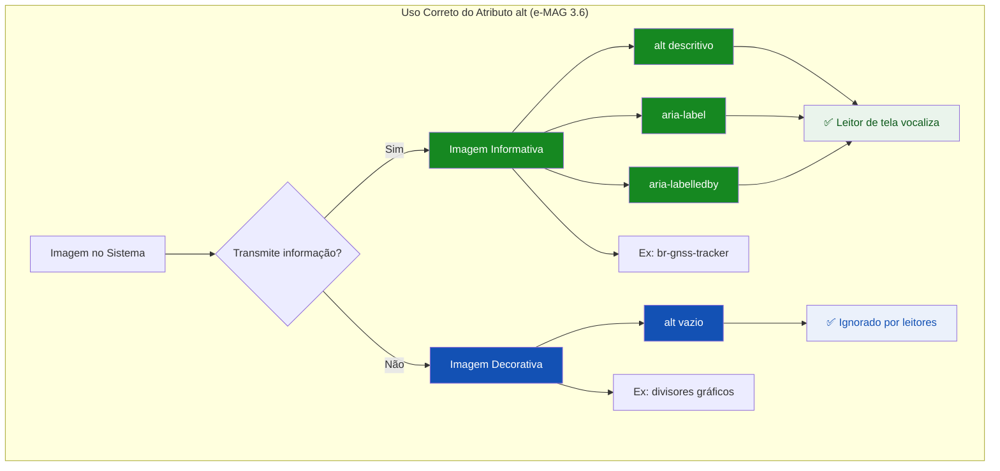
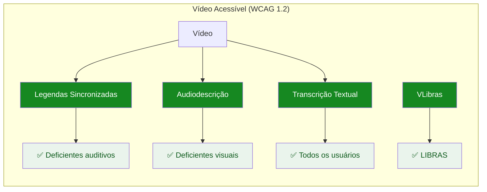
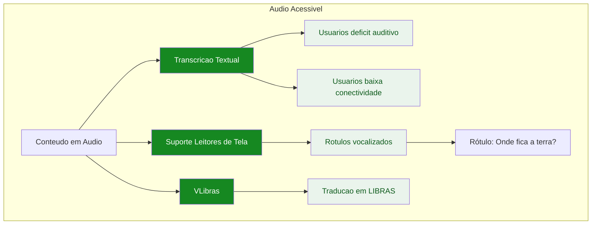
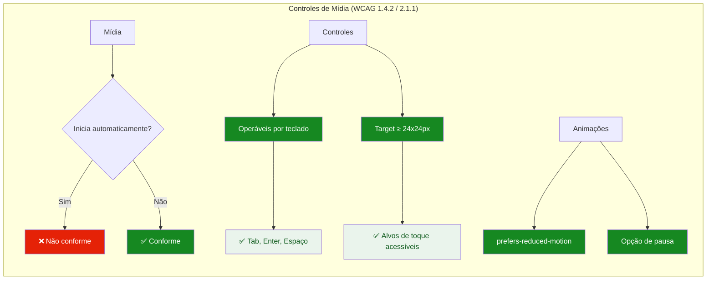
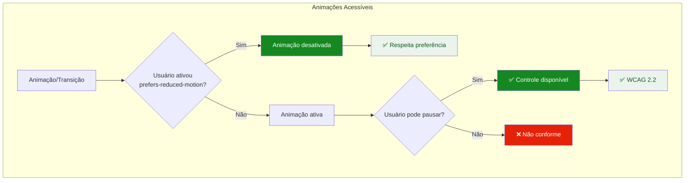
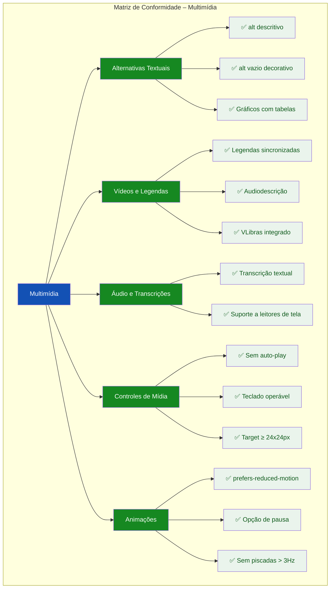

# 🎨 Guia Visual: Ilustrando as Diretrizes de Multimídia (e-MAG 3.1)

## Abordagens Práticas para a TASK-F1-UX-003.5

---

## 📌 Estratégia Geral de Visualização

Para a **Área de Multimídia do e-MAG 3.1** combinada com os princípios da **WCAG 2.2**, recomendo **cinco formatos complementares**:

| Formato | Quando Usar | Melhor para |
|---------|-------------|-------------|
| **Comparativo de Alt** | Demonstrar alternativas textuais | Imagens informativas vs. decorativas |
| **Diagrama de Legendas** | Ilustrar acessibilidade em vídeos | Legendas e audiodescrição |
| **Cards de Áudio** | Mostrar transcrições | Conteúdo em áudio e VLibras |
| **Demonstração de Controles** | Validar operabilidade | Botões de mídia acessíveis |
| **Checklist Visual** | Consolidar conformidade | Matriz de auditoria |

---

## 1. ALTERNATIVAS TEXTUAIS PARA IMAGENS

### 1.1 Diagrama de Uso do Atributo `alt`



### 1.2 Exemplo Interativo – Comparativo de `alt`

```html
<!-- Comparativo de Atributo alt -->
<div class="card" style="margin-bottom:1.5rem;">
  <h3 style="font-size:0.8rem; font-weight:600; text-transform:uppercase; letter-spacing:0.05em; color:#1351B4; margin-bottom:1rem;">🖼️ Alternativas Textuais (e-MAG 3.6)</h3>
  
  <div class="grid-2">
    <!-- Imagem Informativa -->
    <div style="border:1px solid #168821; border-radius:8px; padding:1rem; background:#FFFFFF;">
      <div style="display:flex; align-items:center; gap:0.5rem; margin-bottom:0.5rem;">
        <span style="background:#168821; color:#FFFFFF; padding:0.125rem 0.5rem; border-radius:4px; font-size:0.6rem; font-weight:600;">✓ CONFORME</span>
      </div>
      <div style="background:#F8FAFC; padding:0.75rem; border-radius:4px; border:1px solid #C5D4EB; text-align:center;">
        <div style="font-size:3rem; margin-bottom:0.25rem;">📡</div>
        <div style="font-size:0.65rem; color:#555770; font-family:'JetBrains Mono',monospace; background:#EAF4EC; padding:0.25rem 0.5rem; border-radius:4px; display:inline-block;">
          alt="Status da precisão GNSS: verde indicando HDOP 2.1, sinal ótimo para captura de coordenadas"
        </div>
        <div style="font-size:0.65rem; color:#168821; margin-top:0.5rem;">
          ✅ Leitor de tela vocaliza a descrição completa
        </div>
      </div>
    </div>
    
    <!-- Imagem Decorativa -->
    <div style="border:1px solid #168821; border-radius:8px; padding:1rem; background:#FFFFFF;">
      <div style="display:flex; align-items:center; gap:0.5rem; margin-bottom:0.5rem;">
        <span style="background:#168821; color:#FFFFFF; padding:0.125rem 0.5rem; border-radius:4px; font-size:0.6rem; font-weight:600;">✓ CONFORME</span>
      </div>
      <div style="background:#F8FAFC; padding:0.75rem; border-radius:4px; border:1px solid #C5D4EB; text-align:center;">
        <div style="font-size:3rem; margin-bottom:0.25rem;">───</div>
        <div style="font-size:0.65rem; color:#555770; font-family:'JetBrains Mono',monospace; background:#EAF4EC; padding:0.25rem 0.5rem; border-radius:4px; display:inline-block;">
          alt=""
        </div>
        <div style="font-size:0.65rem; color:#168821; margin-top:0.5rem;">
          ✅ Leitor de tela ignora (redução de ruído)
        </div>
      </div>
    </div>
  </div>
  
  <div style="margin-top:0.75rem; padding:0.5rem 0.75rem; background:#EBF1FB; border-radius:4px; font-size:0.75rem; color:#1351B4;">
    ✅ Imagens informativas com alt descritivo. Imagens decorativas com alt vazio.
  </div>
</div>
```

---

## 2. VÍDEOS, LEGENDAS E AUDIODESCRIÇÃO

### 2.1 Diagrama de Acessibilidade em Vídeos



### 2.2 Exemplo Interativo – Player de Vídeo Acessível

```html
<!-- Player de Vídeo Acessível -->
<div class="card" style="margin-bottom:1.5rem;">
  <h3 style="font-size:0.8rem; font-weight:600; text-transform:uppercase; letter-spacing:0.05em; color:#1351B4; margin-bottom:1rem;">🎬 Vídeo com Legendas e Audiodescrição</h3>
  
  <div style="border:1px solid #C5D4EB; border-radius:8px; padding:1rem; background:#F8FAFC;">
    <!-- Simulação de Player -->
    <div style="background:#071D41; border-radius:4px; padding:2rem; text-align:center; color:#FFFFFF;">
      <div style="font-size:4rem; margin-bottom:0.5rem;">▶️</div>
      <div style="font-size:0.875rem; color:#93B8E8;">Manual do Recenseador – Coleta de Dados</div>
      <div style="font-size:0.65rem; color:#555A75; margin-top:0.25rem;">Duração: 5:23</div>
    </div>
    
    <!-- Controles -->
    <div style="display:flex; gap:0.5rem; margin-top:0.75rem; flex-wrap:wrap; align-items:center;">
      <button style="background:#1351B4; color:#FFFFFF; border:none; padding:0.5rem 0.75rem; border-radius:4px; font-size:0.75rem; cursor:pointer;">▶ Play</button>
      <button style="background:#1351B4; color:#FFFFFF; border:none; padding:0.5rem 0.75rem; border-radius:4px; font-size:0.75rem; cursor:pointer;">⏸ Pause</button>
      <button style="background:#1351B4; color:#FFFFFF; border:none; padding:0.5rem 0.75rem; border-radius:4px; font-size:0.75rem; cursor:pointer;">🔊</button>
      <span style="font-size:0.65rem; color:#555770; margin-left:0.5rem;">Controles acessíveis por teclado</span>
    </div>
    
    <!-- Recursos de Acessibilidade -->
    <div style="display:flex; gap:0.75rem; margin-top:0.75rem; flex-wrap:wrap;">
      <span style="background:#EAF4EC; color:#168821; padding:0.125rem 0.5rem; border-radius:12px; font-size:0.6rem; font-weight:600;">✅ Legendas</span>
      <span style="background:#EAF4EC; color:#168821; padding:0.125rem 0.5rem; border-radius:12px; font-size:0.6rem; font-weight:600;">✅ Audiodescrição</span>
      <span style="background:#EAF4EC; color:#168821; padding:0.125rem 0.5rem; border-radius:12px; font-size:0.6rem; font-weight:600;">✅ VLibras</span>
      <span style="background:#EAF4EC; color:#168821; padding:0.125rem 0.5rem; border-radius:12px; font-size:0.6rem; font-weight:600;">✅ Transcrição</span>
    </div>
  </div>
  
  <div style="margin-top:0.75rem; padding:0.5rem 0.75rem; background:#EBF1FB; border-radius:4px; font-size:0.75rem; color:#1351B4;">
    ✅ Vídeos com legendas sincronizadas, audiodescrição e integração com VLibras.
  </div>
</div>
```

---

## 3. CONTEÚDO EM ÁUDIO E TRANSCRIÇÕES

### 3.1 Diagrama de Acessibilidade em Áudio



### 3.2 Exemplo Interativo – Transcrição de Áudio

```html
<!-- Transcrição de Áudio -->
<div class="card" style="margin-bottom:1.5rem;">
  <h3 style="font-size:0.8rem; font-weight:600; text-transform:uppercase; letter-spacing:0.05em; color:#1351B4; margin-bottom:1rem;">🎧 Áudio com Transcrição Textual</h3>
  
  <div style="border:1px solid #C5D4EB; border-radius:8px; padding:1rem; background:#F8FAFC;">
    <!-- Player de Áudio -->
    <div style="display:flex; align-items:center; gap:0.75rem; padding:0.5rem; background:#FFFFFF; border-radius:4px; border:1px solid #C5D4EB;">
      <span style="font-size:1.5rem;">🎙️</span>
      <div style="flex:1;">
        <div style="font-size:0.875rem; font-weight:500; color:#071D41;">Instrução: Como capturar coordenadas GNSS</div>
        <div style="font-size:0.65rem; color:#555770;">Duração: 1:30</div>
      </div>
      <button style="background:#1351B4; color:#FFFFFF; border:none; padding:0.25rem 0.75rem; border-radius:4px; font-size:0.75rem; cursor:pointer;">▶ Ouvir</button>
    </div>
    
    <!-- Transcrição -->
    <div style="margin-top:0.75rem; padding:0.75rem; background:#FFFFFF; border-radius:4px; border:1px solid #C5D4EB;">
      <div style="font-size:0.65rem; font-weight:600; color:#1351B4; text-transform:uppercase; letter-spacing:0.05em;">📝 Transcrição</div>
      <p style="font-size:0.875rem; color:#1C1C1E; margin-top:0.25rem; line-height:1.6;">
        "Para capturar as coordenadas do estabelecimento, posicione-se na entrada principal da propriedade. 
        Aguarde o sinal do satélite estabilizar. O indicador verde significa que a precisão está ótima. 
        Se o indicador estiver vermelho, mova-se para uma área aberta e tente novamente."
      </p>
    </div>
  </div>
  
  <div style="margin-top:0.75rem; padding:0.5rem 0.75rem; background:#EBF1FB; border-radius:4px; font-size:0.75rem; color:#1351B4;">
    ✅ Todo áudio possui transcrição textual completa e acessível.
  </div>
</div>
```

---

## 4. CONTROLES DE MÍDIA E ANIMAÇÕES

### 4.1 Diagrama de Controles Acessíveis



### 4.2 Exemplo Interativo – Controles Acessíveis

```html
<!-- Controles de Mídia Acessíveis -->
<div class="card" style="margin-bottom:1.5rem;">
  <h3 style="font-size:0.8rem; font-weight:600; text-transform:uppercase; letter-spacing:0.05em; color:#1351B4; margin-bottom:1rem;">🎮 Controles de Mídia Acessíveis</h3>
  
  <div style="display:grid; grid-template-columns:1fr 1fr; gap:1rem;">
    <!-- Controles Conformes -->
    <div style="border:1px solid #168821; border-radius:8px; padding:1rem; background:#FFFFFF;">
      <div style="display:flex; align-items:center; gap:0.5rem; margin-bottom:0.5rem;">
        <span style="background:#168821; color:#FFFFFF; padding:0.125rem 0.5rem; border-radius:4px; font-size:0.6rem; font-weight:600;">✓ CONFORME</span>
      </div>
      <div style="display:flex; gap:0.5rem; flex-wrap:wrap;">
        <button style="background:#1351B4; color:#FFFFFF; border:none; padding:0.5rem 0.75rem; border-radius:4px; font-size:0.75rem; cursor:pointer; min-width:3rem; min-height:2.5rem;">▶</button>
        <button style="background:#1351B4; color:#FFFFFF; border:none; padding:0.5rem 0.75rem; border-radius:4px; font-size:0.75rem; cursor:pointer; min-width:3rem; min-height:2.5rem;">⏸</button>
        <button style="background:#1351B4; color:#FFFFFF; border:none; padding:0.5rem 0.75rem; border-radius:4px; font-size:0.75rem; cursor:pointer; min-width:3rem; min-height:2.5rem;">🔊</button>
      </div>
      <div style="font-size:0.65rem; color:#168821; margin-top:0.5rem;">
        ✅ Operável por teclado (Tab, Enter, Espaço)
      </div>
      <div style="font-size:0.65rem; color:#168821;">
        ✅ Target ≥ 24x24px (WCAG 2.5.8)
      </div>
    </div>
    
    <!-- Controles Não Conformes -->
    <div style="border:1px solid #E52207; border-radius:8px; padding:1rem; background:#FFFFFF;">
      <div style="display:flex; align-items:center; gap:0.5rem; margin-bottom:0.5rem;">
        <span style="background:#E52207; color:#FFFFFF; padding:0.125rem 0.5rem; border-radius:4px; font-size:0.6rem; font-weight:600;">✗ FALHA</span>
      </div>
      <div style="display:flex; gap:0.25rem; flex-wrap:wrap;">
        <button style="background:#1351B4; color:#FFFFFF; border:none; padding:0.125rem 0.25rem; border-radius:4px; font-size:0.5rem; cursor:pointer;">▶</button>
        <button style="background:#1351B4; color:#FFFFFF; border:none; padding:0.125rem 0.25rem; border-radius:4px; font-size:0.5rem; cursor:pointer;">⏸</button>
        <button style="background:#1351B4; color:#FFFFFF; border:none; padding:0.125rem 0.25rem; border-radius:4px; font-size:0.5rem; cursor:pointer;">🔊</button>
      </div>
      <div style="font-size:0.65rem; color:#E52207; margin-top:0.5rem;">
        ❌ Target < 24x24px (falha WCAG 2.5.8)
      </div>
      <div style="font-size:0.65rem; color:#E52207;">
        ❌ Sem suporte adequado a teclado
      </div>
    </div>
  </div>
  
  <div style="margin-top:0.75rem; padding:0.5rem 0.75rem; background:#EBF1FB; border-radius:4px; font-size:0.75rem; color:#1351B4;">
    ✅ Controles de mídia operáveis por teclado com alvos de toque mínimos de 24x24px.
  </div>
</div>
```

---

## 5. ANIMAÇÕES E `prefers-reduced-motion`

### 5.1 Diagrama de Animações Controladas



### 5.2 Exemplo Interativo – Controle de Animações

```html
<!-- Controle de Animações -->
<div class="card" style="margin-bottom:1.5rem;">
  <h3 style="font-size:0.8rem; font-weight:600; text-transform:uppercase; letter-spacing:0.05em; color:#1351B4; margin-bottom:1rem;">🔄 Controle de Animações</h3>
  
  <div style="border:1px solid #C5D4EB; border-radius:8px; padding:1rem; background:#F8FAFC;">
    <!-- Animação com Controle -->
    <div style="background:#FFFFFF; padding:0.75rem; border-radius:4px; border:1px solid #C5D4EB; margin-bottom:0.75rem;">
      <div style="display:flex; align-items:center; gap:1rem; flex-wrap:wrap;">
        <div style="width:2rem; height:2rem; background:#1351B4; border-radius:50%; animation:pulse-ring 2s infinite;"></div>
        <div style="font-size:0.875rem; color:#1C1C1E;">Animação de carregamento ativa</div>
      </div>
    </div>
    
    <!-- Controles -->
    <div style="display:flex; gap:0.75rem; flex-wrap:wrap;">
      <button style="background:#1351B4; color:#FFFFFF; border:none; padding:0.5rem 0.75rem; border-radius:4px; font-size:0.75rem; cursor:pointer;">⏸ Pausar animações</button>
      <button style="background:#1351B4; color:#FFFFFF; border:none; padding:0.5rem 0.75rem; border-radius:4px; font-size:0.75rem; cursor:pointer;">▶ Retomar</button>
      <span style="font-size:0.65rem; color:#555770; display:flex; align-items:center;">
        ⚙️ <code style="font-size:0.6rem; margin-left:0.25rem;">prefers-reduced-motion</code> suportado
      </span>
    </div>
  </div>
  
  <div style="margin-top:0.75rem; padding:0.5rem 0.75rem; background:#EBF1FB; border-radius:4px; font-size:0.75rem; color:#1351B4;">
    ✅ Animações podem ser pausadas. Respeita a configuração prefers-reduced-motion do sistema.
  </div>
</div>
```

---

## 6. RESUMO VISUAL: CHECKLIST DE MULTIMÍDIA



---

## 📚 Resumo: Ferramentas para Ilustrar Diretrizes de Multimídia

| Formato | Ferramenta | Melhor para |
|---------|------------|-------------|
| **Comparativo de Alt** | HTML/CSS | Imagens informativas vs. decorativas |
| **Diagrama de Legendas** | Mermaid, Figma | Acessibilidade em vídeos |
| **Player de Vídeo** | HTML/CSS | Legendas, audiodescrição, VLibras |
| **Transcrição de Áudio** | HTML/CSS | Conteúdo em áudio |
| **Controles de Mídia** | HTML/CSS | Botões acessíveis e target size |
| **Checklist Visual** | Mermaid, Notion | Matriz de conformidade |

---

## 💡 Recomendações de Implementação

| Diretriz | Forma de Ilustrar no Projeto |
|----------|------------------------------|
| **Alternativas Textuais** | Exemplo lado a lado: imagem informativa vs. decorativa com alt correto |
| **Vídeos com Legendas** | Player de vídeo simulado com indicadores de legendas e audiodescrição |
| **VLibras** | Ícone indicando suporte à Língua Brasileira de Sinais |
| **Transcrição de Áudio** | Player de áudio com transcrição textual expansível |
| **Controles de Mídia** | Comparação de botões com target size adequado vs. inadequado |
| **Auto-play** | Indicador visual de "Sem reprodução automática" |
| **Animações** | Controle de pausa e indicação de suporte a prefers-reduced-motion |

---

*Este guia serve como referência visual para a auditoria de Multimídia do "Censo Fácil", ilustrando cada diretriz do e-MAG 3.1 e da WCAG 2.2 de forma clara e prática para a TASK-F1-UX-003.5.*