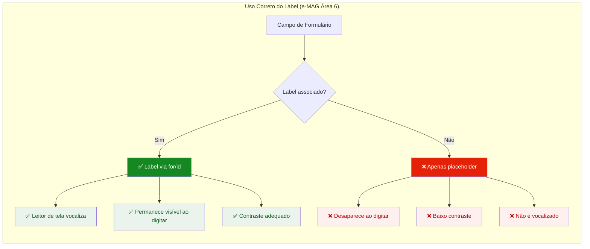
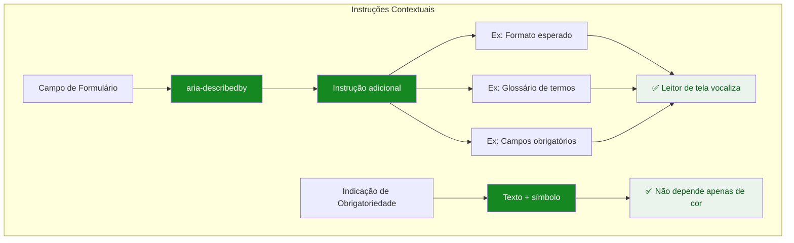
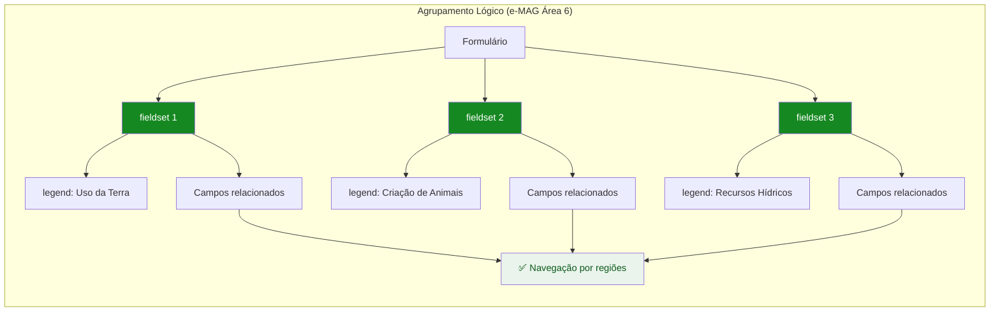
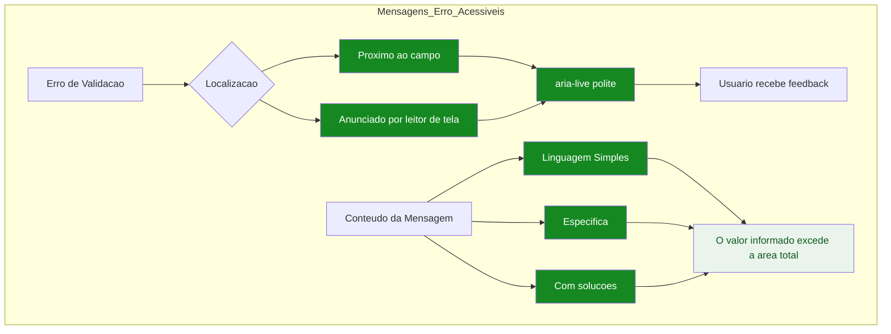
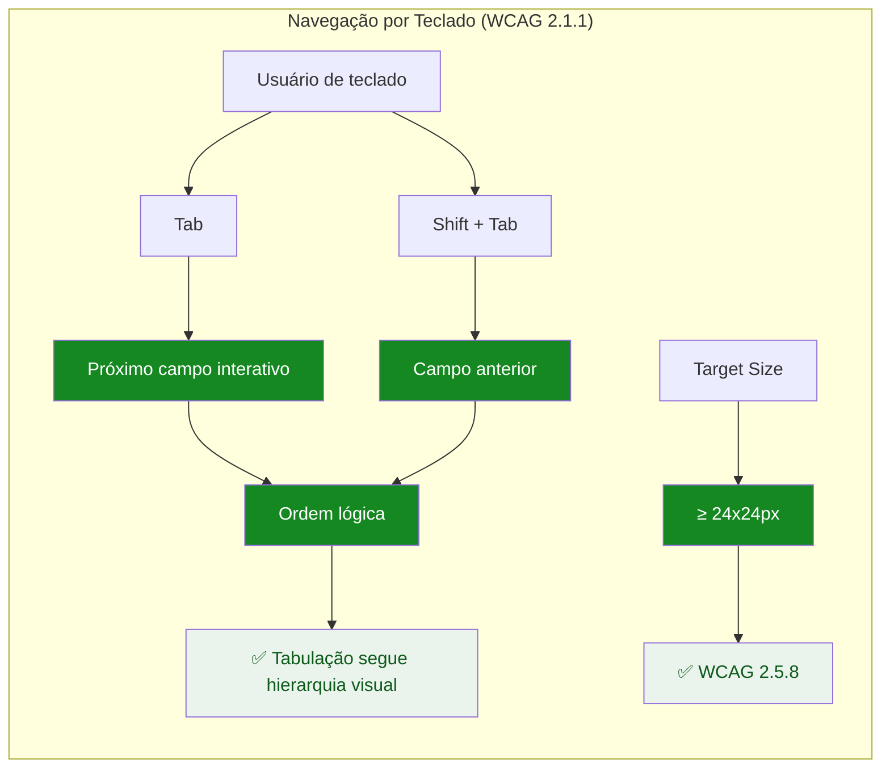
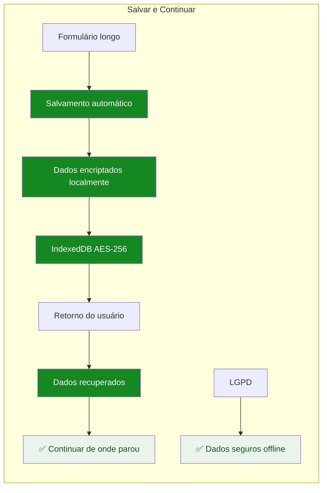
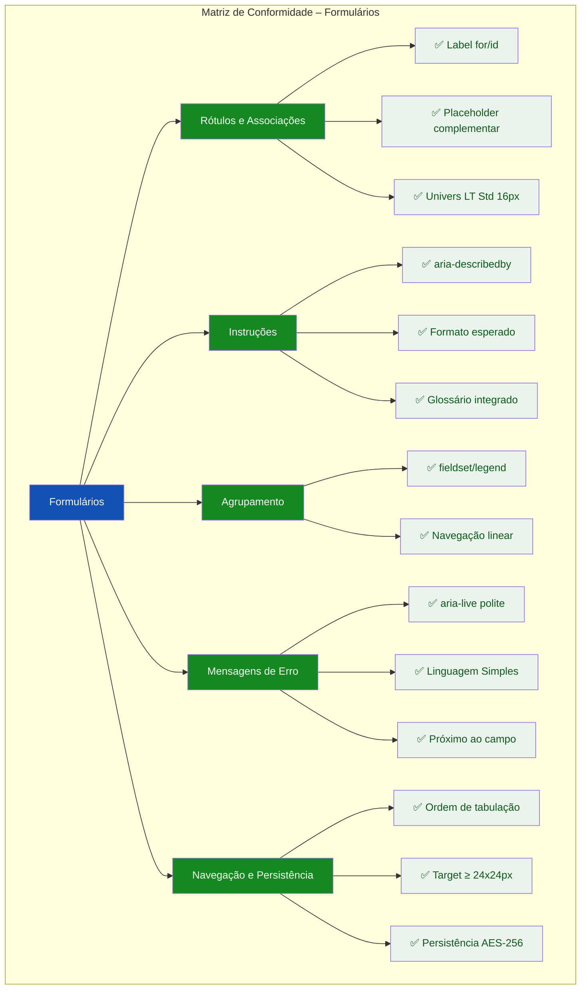

# 🎨 Guia Visual: Ilustrando as Diretrizes de Formulário (e-MAG 3.1)

## Abordagens Práticas para a TASK-F1-UX-003.6

---

## 📌 Estratégia Geral de Visualização

Para a **Área de Formulário do e-MAG 3.1** combinada com os critérios da **WCAG 2.2**, recomendo **cinco formatos complementares**:

| Formato | Quando Usar | Melhor para |
|---------|-------------|-------------|
| **Comparativo Label vs. Placeholder** | Demonstrar associação correta | Rótulos e acessibilidade |
| **Diagrama de Agrupamento** | Mostrar organização temática | Fieldsets e legendas |
| **Exemplo de Validação** | Ilustrar mensagens de erro | Alertas e `aria-live` |
| **Demonstração de Navegação** | Validar operabilidade | Tabulação e target size |
| **Checklist Visual** | Consolidar conformidade | Matriz de auditoria |

---

## 1. RÓTULOS, ASSOCIAÇÕES E PLACEHOLDER

### 1.1 Comparativo: Label vs. Placeholder



### 1.2 Exemplo Interativo – Label vs. Placeholder

```html
<!-- Comparativo Label vs. Placeholder -->
<div class="card" style="margin-bottom:1.5rem;">
  <h3 style="font-size:0.8rem; font-weight:600; text-transform:uppercase; letter-spacing:0.05em; color:#1351B4; margin-bottom:1rem;">🏷️ Label vs. Placeholder (e-MAG Área 6)</h3>
  
  <div class="grid-2">
    <!-- Correto: com Label -->
    <div style="border:1px solid #168821; border-radius:8px; padding:1rem; background:#FFFFFF;">
      <div style="display:flex; align-items:center; gap:0.5rem; margin-bottom:0.5rem;">
        <span style="background:#168821; color:#FFFFFF; padding:0.125rem 0.5rem; border-radius:4px; font-size:0.6rem; font-weight:600;">✓ CONFORME</span>
      </div>
      <div style="background:#F8FAFC; padding:0.75rem; border-radius:4px; border:1px solid #C5D4EB;">
        <label for="nome-correto" style="display:block; font-size:0.875rem; font-weight:500; color:#1C1C1E; margin-bottom:0.25rem;">
          Nome completo do produtor
          <span style="color:#E52207; margin-left:0.25rem; font-size:0.75rem;">*</span>
        </label>
        <input type="text" id="nome-correto" placeholder="Digite o nome completo" style="width:100%; padding:0.5rem 0.75rem; border-radius:4px; border:1px solid #C5D4EB; font-size:0.875rem; font-family:'DM Sans',sans-serif;" />
        <div style="font-size:0.65rem; color:#168821; margin-top:0.25rem;">
          ✅ Label visível e associado via for/id
        </div>
      </div>
    </div>
    
    <!-- Incorreto: apenas placeholder -->
    <div style="border:1px solid #E52207; border-radius:8px; padding:1rem; background:#FFFFFF;">
      <div style="display:flex; align-items:center; gap:0.5rem; margin-bottom:0.5rem;">
        <span style="background:#E52207; color:#FFFFFF; padding:0.125rem 0.5rem; border-radius:4px; font-size:0.6rem; font-weight:600;">✗ FALHA</span>
      </div>
      <div style="background:#F8FAFC; padding:0.75rem; border-radius:4px; border:1px solid #E52207;">
        <input type="text" placeholder="Nome completo do produtor" style="width:100%; padding:0.5rem 0.75rem; border-radius:4px; border:1px solid #E52207; font-size:0.875rem; font-family:'DM Sans',sans-serif; color:#9999AA;" />
        <div style="font-size:0.65rem; color:#E52207; margin-top:0.25rem;">
          ❌ Placeholder não substitui label (e-MAG)
        </div>
        <ul style="font-size:0.65rem; color:#E52207; list-style:none; padding:0; margin:0.25rem 0 0 0;">
          <li>✗ Desaparece ao digitar</li>
          <li>✗ Não é vocalizado por leitores de tela</li>
          <li>✗ Baixo contraste</li>
        </ul>
      </div>
    </div>
  </div>
  
  <div style="margin-top:0.75rem; padding:0.5rem 0.75rem; background:#EBF1FB; border-radius:4px; font-size:0.75rem; color:#1351B4;">
    ✅ Todo campo possui <code>label</code> associado via <code>for/id</code>. Placeholder é apenas complementar.
  </div>
</div>
```

---

## 2. INSTRUÇÕES E DICAS CONTEXTUAIS

### 2.1 Diagrama de Instruções com `aria-describedby`



### 2.2 Exemplo Interativo – Campo com Instrução

```html
<!-- Campo com Instrução Contextual -->
<div class="card" style="margin-bottom:1.5rem;">
  <h3 style="font-size:0.8rem; font-weight:600; text-transform:uppercase; letter-spacing:0.05em; color:#1351B4; margin-bottom:1rem;">💡 Instruções e Dicas Contextuais</h3>
  
  <div style="border:1px solid #C5D4EB; border-radius:8px; padding:1rem; background:#F8FAFC;">
    <!-- Campo com instrução -->
    <div style="margin-bottom:1rem;">
      <label for="area-total" style="display:block; font-size:0.875rem; font-weight:500; color:#1C1C1E; margin-bottom:0.25rem;">
        Área total do estabelecimento
        <span style="color:#E52207; margin-left:0.25rem; font-size:0.75rem;">*</span>
      </label>
      <div id="area-help" style="font-size:0.75rem; color:#555770; margin-bottom:0.375rem;">
        Informe a área total em hectares. Exemplo: 50,5
        <span style="display:inline-block; margin-left:0.5rem; background:#EBF1FB; color:#1351B4; padding:0.125rem 0.375rem; border-radius:4px; font-size:0.6rem;">
          ⓘ 1 hectare = 1,0 alqueire paulista
        </span>
      </div>
      <div style="display:flex; gap:0.5rem; align-items:center;">
        <input type="number" id="area-total" step="0.1" aria-describedby="area-help" style="flex:1; padding:0.5rem 0.75rem; border-radius:4px; border:1px solid #C5D4EB; font-size:0.875rem; font-family:'DM Sans',sans-serif;" />
        <span style="font-size:0.875rem; font-family:'JetBrains Mono',monospace; color:#555770;">ha</span>
      </div>
      <div style="font-size:0.65rem; color:#168821; margin-top:0.25rem;">
        ✅ Instrução vinculada via <code>aria-describedby</code>
      </div>
    </div>
    
    <!-- Indicação de obrigatoriedade -->
    <div style="padding:0.5rem 0.75rem; background:#EAF4EC; border-radius:4px; font-size:0.75rem; color:#0D5A1B;">
      ✅ Campos obrigatórios indicados por texto e símbolo (*) – não depende apenas de cor.
    </div>
  </div>
  
  <div style="margin-top:0.75rem; padding:0.5rem 0.75rem; background:#EBF1FB; border-radius:4px; font-size:0.75rem; color:#1351B4;">
    ✅ Instruções fornecidas antes do campo via <code>aria-describedby</code>. Glossário integrado para termos técnicos.
  </div>
</div>
```

---

## 3. AGRUPAMENTO DE CAMPOS E FLUXO LÓGICO

### 3.1 Diagrama de Agrupamento com Fieldsets



### 3.2 Exemplo Interativo – Agrupamento com Fieldset

```html
<!-- Agrupamento com Fieldset -->
<div class="card" style="margin-bottom:1.5rem;">
  <h3 style="font-size:0.8rem; font-weight:600; text-transform:uppercase; letter-spacing:0.05em; color:#1351B4; margin-bottom:1rem;">📂 Agrupamento Lógico (fieldset/legend)</h3>
  
  <form style="border:1px solid #C5D4EB; border-radius:8px; padding:1rem; background:#F8FAFC;">
    <!-- Fieldset 1 -->
    <fieldset style="border:2px solid #1351B4; border-radius:8px; padding:0.75rem; margin-bottom:1rem;">
      <legend style="font-weight:600; font-size:0.875rem; color:#1351B4; padding:0 0.5rem;">🌾 Uso da Terra</legend>
      <div style="display:grid; grid-template-columns:1fr 1fr; gap:0.75rem;">
        <div>
          <label style="font-size:0.75rem; font-weight:500; color:#1C1C1E;">Área total (ha)</label>
          <input type="number" style="width:100%; padding:0.375rem 0.5rem; border-radius:4px; border:1px solid #C5D4EB; font-size:0.75rem;" />
        </div>
        <div>
          <label style="font-size:0.75rem; font-weight:500; color:#1C1C1E;">Área cultivada (ha)</label>
          <input type="number" style="width:100%; padding:0.375rem 0.5rem; border-radius:4px; border:1px solid #C5D4EB; font-size:0.75rem;" />
        </div>
      </div>
    </fieldset>
    
    <!-- Fieldset 2 -->
    <fieldset style="border:2px solid #168821; border-radius:8px; padding:0.75rem; margin-bottom:1rem;">
      <legend style="font-weight:600; font-size:0.875rem; color:#168821; padding:0 0.5rem;">🐄 Criação de Animais</legend>
      <div style="display:grid; grid-template-columns:1fr 1fr; gap:0.75rem;">
        <div>
          <label style="font-size:0.75rem; font-weight:500; color:#1C1C1E;">Bovinos (cabeças)</label>
          <input type="number" style="width:100%; padding:0.375rem 0.5rem; border-radius:4px; border:1px solid #C5D4EB; font-size:0.75rem;" />
        </div>
        <div>
          <label style="font-size:0.75rem; font-weight:500; color:#1C1C1E;">Aves (cabeças)</label>
          <input type="number" style="width:100%; padding:0.375rem 0.5rem; border-radius:4px; border:1px solid #C5D4EB; font-size:0.75rem;" />
        </div>
      </div>
    </fieldset>
    
    <!-- Fieldset 3 -->
    <fieldset style="border:2px solid #F5A623; border-radius:8px; padding:0.75rem;">
      <legend style="font-weight:600; font-size:0.875rem; color:#916A00; padding:0 0.5rem;">💧 Recursos Hídricos</legend>
      <div style="display:grid; grid-template-columns:1fr 1fr; gap:0.75rem;">
        <div>
          <label style="font-size:0.75rem; font-weight:500; color:#1C1C1E;">Fonte de captação</label>
          <select style="width:100%; padding:0.375rem 0.5rem; border-radius:4px; border:1px solid #C5D4EB; font-size:0.75rem;">
            <option>Selecione...</option>
            <option>Poço artesiano</option>
            <option>Rio/igarapé</option>
            <option>Nascente</option>
          </select>
        </div>
        <div>
          <label style="font-size:0.75rem; font-weight:500; color:#1C1C1E;">Sistema de irrigação</label>
          <select style="width:100%; padding:0.375rem 0.5rem; border-radius:4px; border:1px solid #C5D4EB; font-size:0.75rem;">
            <option>Selecione...</option>
            <option>Gotejamento</option>
            <option>Aspersão</option>
            <option>Não utiliza</option>
          </select>
        </div>
      </div>
    </fieldset>
  </form>
  
  <div style="margin-top:0.75rem; padding:0.5rem 0.75rem; background:#EBF1FB; border-radius:4px; font-size:0.75rem; color:#1351B4;">
    ✅ Campos relacionados agrupados semanticamente com <code>fieldset</code> e <code>legend</code>.
  </div>
</div>
```

---

## 4. MENSAGENS DE ERRO E VALIDAÇÃO

### 4.1 Diagrama de Mensagens de Erro



### 4.2 Exemplo Interativo – Validação em Tempo Real

```html
<!-- Validação em Tempo Real -->
<div class="card" style="margin-bottom:1.5rem;">
  <h3 style="font-size:0.8rem; font-weight:600; text-transform:uppercase; letter-spacing:0.05em; color:#1351B4; margin-bottom:1rem;">⚠️ Mensagens de Erro Acessíveis</h3>
  
  <div style="border:1px solid #C5D4EB; border-radius:8px; padding:1rem; background:#F8FAFC;">
    <!-- Campo com validação -->
    <div style="margin-bottom:1rem;">
      <label for="area-pasto" style="display:block; font-size:0.875rem; font-weight:500; color:#1C1C1E; margin-bottom:0.25rem;">
        Área de pastagem (hectares)
        <span style="color:#E52207; margin-left:0.25rem; font-size:0.75rem;">*</span>
      </label>
      <input type="number" id="area-pasto" value="150" style="width:100%; padding:0.5rem 0.75rem; border-radius:4px; border:2px solid #E52207; font-size:0.875rem; font-family:'DM Sans',sans-serif; background:#FEF8F8;" />
      
      <!-- Mensagem de erro -->
      <div role="alert" aria-live="polite" style="margin-top:0.375rem; padding:0.5rem 0.75rem; background:#FEF0EF; border-radius:4px; border-left:4px solid #E52207;">
        <div style="display:flex; align-items:flex-start; gap:0.5rem;">
          <span style="color:#E52207; font-weight:700;">⚠️</span>
          <div>
            <div style="font-size:0.875rem; font-weight:500; color:#B30000;">Área de pastagem não pode exceder a área total do estabelecimento</div>
            <div style="font-size:0.75rem; color:#555770;">A área total informada é de 100 hectares. Reduza o valor ou ajuste a área total.</div>
          </div>
        </div>
      </div>
      
      <div style="font-size:0.65rem; color:#168821; margin-top:0.25rem;">
        ✅ Mensagem de erro com <code>role="alert"</code> e <code>aria-live="polite"</code>
      </div>
    </div>
    
    <!-- Exemplo de erro com linguagem simples -->
    <div style="padding:0.5rem 0.75rem; background:#EAF4EC; border-radius:4px; font-size:0.75rem; color:#0D5A1B;">
      ✅ Mensagens específicas, em Linguagem Simples, próximas ao campo e anunciadas por leitores de tela.
    </div>
  </div>
  
  <div style="margin-top:0.75rem; padding:0.5rem 0.75rem; background:#EBF1FB; border-radius:4px; font-size:0.75rem; color:#1351B4;">
    ✅ Erros de consistência lógica geram alertas imediatos com instruções claras de correção.
  </div>
</div>
```

---

## 5. NAVEGAÇÃO POR TECLADO E TARGET SIZE

### 5.1 Diagrama de Navegação por Teclado



### 5.2 Exemplo Interativo – Ordem de Tabulação

```html
<!-- Ordem de Tabulação -->
<div class="card" style="margin-bottom:1.5rem;">
  <h3 style="font-size:0.8rem; font-weight:600; text-transform:uppercase; letter-spacing:0.05em; color:#1351B4; margin-bottom:1rem;">⌨️ Navegação por Teclado</h3>
  
  <div style="border:1px solid #C5D4EB; border-radius:8px; padding:1rem; background:#F8FAFC;">
    <div style="font-size:0.65rem; color:#555770; margin-bottom:0.5rem;">
      ⚡ Pressione <kbd>Tab</kbd> para navegar pelos campos na ordem correta
    </div>
    
    <!-- Campos em ordem lógica -->
    <div style="display:grid; grid-template-columns:1fr 1fr; gap:0.75rem;">
      <div>
        <label style="font-size:0.75rem; font-weight:500; color:#1C1C1E;">1. Nome do produtor</label>
        <input type="text" tabindex="1" style="width:100%; padding:0.375rem 0.5rem; border-radius:4px; border:1px solid #C5D4EB; font-size:0.75rem;" />
        <div style="font-size:0.6rem; color:#555770;">Tab ordem 1</div>
      </div>
      <div>
        <label style="font-size:0.75rem; font-weight:500; color:#1C1C1E;">2. Área total (ha)</label>
        <input type="number" tabindex="2" style="width:100%; padding:0.375rem 0.5rem; border-radius:4px; border:1px solid #C5D4EB; font-size:0.75rem;" />
        <div style="font-size:0.6rem; color:#555770;">Tab ordem 2</div>
      </div>
      <div>
        <label style="font-size:0.75rem; font-weight:500; color:#1C1C1E;">3. Principal cultura</label>
        <select tabindex="3" style="width:100%; padding:0.375rem 0.5rem; border-radius:4px; border:1px solid #C5D4EB; font-size:0.75rem;">
          <option>Selecione...</option>
          <option>Soja</option>
          <option>Milho</option>
          <option>Café</option>
        </select>
        <div style="font-size:0.6rem; color:#555770;">Tab ordem 3</div>
      </div>
      <div style="display:flex; align-items:flex-end; gap:0.5rem;">
        <button tabindex="4" style="background:#1351B4; color:#FFFFFF; border:none; padding:0.5rem 1rem; border-radius:4px; font-size:0.75rem; cursor:pointer; min-width:3rem; min-height:2.5rem;">
          Salvar
        </button>
        <div style="font-size:0.6rem; color:#555770;">Tab ordem 4</div>
      </div>
    </div>
    
    <div style="margin-top:0.5rem; padding:0.5rem 0.75rem; background:#EAF4EC; border-radius:4px; font-size:0.65rem; color:#0D5A1B;">
      ✅ Ordem de tabulação lógica: 1 → 2 → 3 → 4, respeitando a hierarquia visual.
    </div>
  </div>
  
  <div style="margin-top:0.75rem; padding:0.5rem 0.75rem; background:#EBF1FB; border-radius:4px; font-size:0.75rem; color:#1351B4;">
    ✅ Elementos interativos com target ≥ 24x24px e ordem de tabulação lógica.
  </div>
</div>
```

---

## 6. PERSISTÊNCIA E SALVAR E CONTINUAR

### 6.1 Diagrama de Persistência de Formulário



### 6.2 Exemplo Interativo – Persistência

```html
<!-- Persistência do Formulário -->
<div class="card" style="margin-bottom:1.5rem;">
  <h3 style="font-size:0.8rem; font-weight:600; text-transform:uppercase; letter-spacing:0.05em; color:#1351B4; margin-bottom:1rem;">💾 Persistência e "Salvar e Continuar"</h3>
  
  <div style="border:1px solid #C5D4EB; border-radius:8px; padding:1rem; background:#F8FAFC;">
    <!-- Status de Salvamento -->
    <div style="display:flex; align-items:center; gap:0.75rem; padding:0.5rem 0.75rem; background:#EAF4EC; border-radius:4px; margin-bottom:0.75rem;">
      <span style="color:#168821; font-weight:700;">✓</span>
      <span style="font-size:0.875rem; color:#0D5A1B;">Progresso salvo localmente</span>
      <span style="font-size:0.65rem; color:#555770; margin-left:auto;">Último salvamento: 14:32</span>
    </div>
    
    <!-- Barra de Progresso -->
    <div style="margin-bottom:0.75rem;">
      <div style="display:flex; justify-content:space-between; font-size:0.65rem; color:#555770; margin-bottom:0.25rem;">
        <span>Progresso</span>
        <span>45%</span>
      </div>
      <div style="height:0.5rem; background:#C5D4EB; border-radius:4px; overflow:hidden;">
        <div style="width:45%; height:100%; background:#1351B4; border-radius:4px;"></div>
      </div>
    </div>
    
    <!-- Ações -->
    <div style="display:flex; gap:0.5rem; flex-wrap:wrap;">
      <button style="background:#1351B4; color:#FFFFFF; border:none; padding:0.5rem 0.75rem; border-radius:4px; font-size:0.75rem; cursor:pointer; min-width:3rem; min-height:2.5rem;">
        💾 Salvar e continuar depois
      </button>
      <button style="background:#168821; color:#FFFFFF; border:none; padding:0.5rem 0.75rem; border-radius:4px; font-size:0.75rem; cursor:pointer; min-width:3rem; min-height:2.5rem;">
        ➡️ Continuar
      </button>
      <span style="font-size:0.65rem; color:#555770; display:flex; align-items:center; margin-left:0.5rem;">
        🔒 Dados encriptados AES-256
      </span>
    </div>
  </div>
  
  <div style="margin-top:0.75rem; padding:0.5rem 0.75rem; background:#EBF1FB; border-radius:4px; font-size:0.75rem; color:#1351B4;">
    ✅ Persistência automática com criptografia AES-256 em conformidade com a LGPD.
  </div>
</div>
```

---

## 7. RESUMO VISUAL: CHECKLIST DE FORMULÁRIOS



---

## 📚 Resumo: Ferramentas para Ilustrar Diretrizes de Formulário

| Formato | Ferramenta | Melhor para |
|---------|------------|-------------|
| **Comparativo Label/Placeholder** | HTML/CSS | Rótulos e associações |
| **Diagrama de Agrupamento** | Mermaid, Figma | Fieldsets e legendas |
| **Exemplo de Validação** | HTML/CSS | Mensagens de erro e `aria-live` |
| **Demonstração de Tabulação** | HTML/CSS | Navegação por teclado |
| **Persistência** | HTML/CSS | Salvar e continuar |
| **Checklist Visual** | Mermaid, Notion | Matriz de conformidade |

---

## 💡 Recomendações de Implementação

| Diretriz | Forma de Ilustrar no Projeto |
|----------|------------------------------|
| **Label vs. Placeholder** | Exemplo lado a lado com label correto vs. apenas placeholder |
| **`aria-describedby`** | Campo com instrução adicional vinculada por ID | 
| **`fieldset`/`legend`** | Agrupamento visual de campos relacionados |
| **Mensagens de Erro** | Campo com validação e mensagem de erro com `role="alert"` |
| **Ordem de Tabulação** | Campos numerados na ordem correta de navegação |
| **Target Size** | Botões com dimensões mínimas indicadas |
| **Persistência** | Barra de progresso e indicação de salvamento local |

---

*Este guia serve como referência visual para a auditoria de Formulários do "Censo Fácil", ilustrando cada diretriz do e-MAG 3.1 e da WCAG 2.2 de forma clara e prática para a TASK-F1-UX-003.6.*