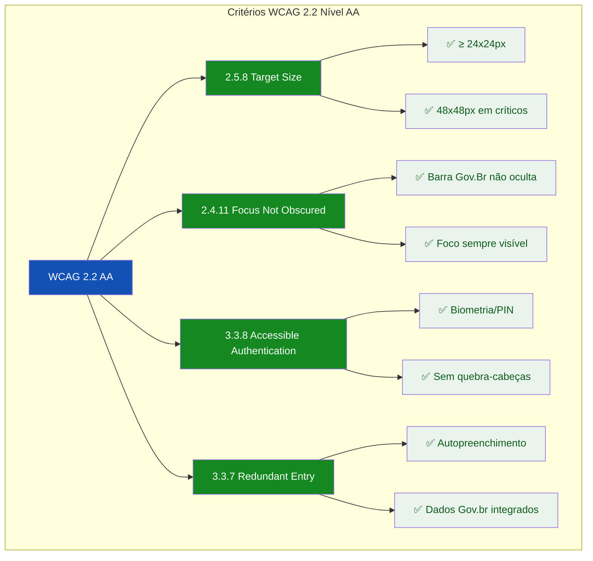
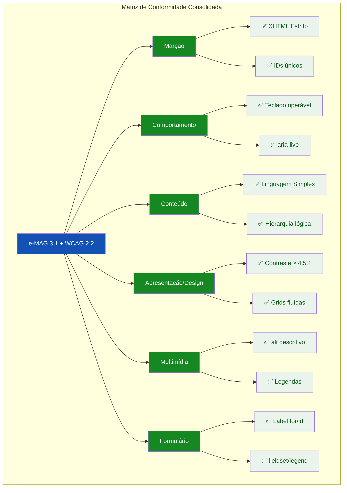
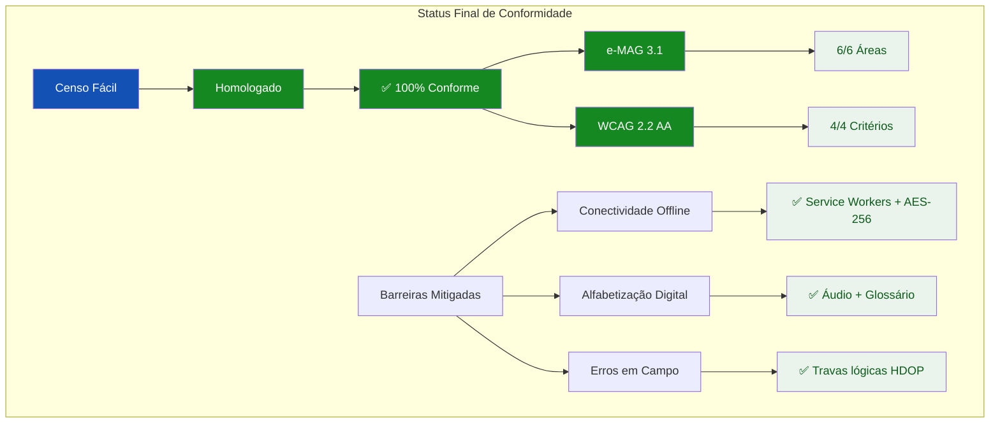
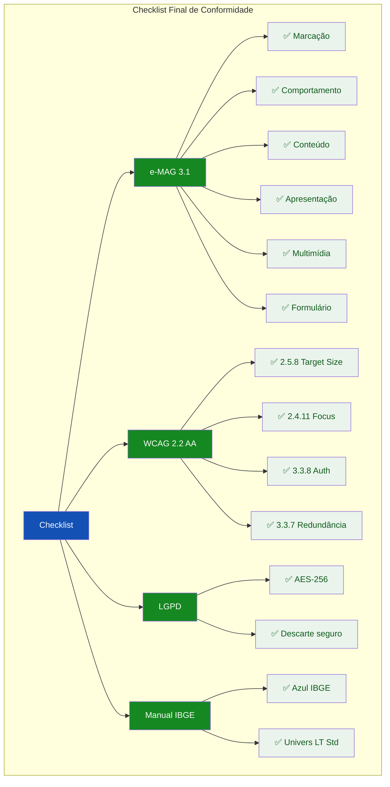

# 🎨 Guia Visual: Ilustrando a Conformidade WCAG 2.2 e Consolidação Final

## Abordagens Práticas para a TASK-F1-UX-003.7

---

## 📌 Estratégia Geral de Visualização

Para a **consolidação final da conformidade WCAG 2.2 Nível AA** e a **matriz consolidada do e-MAG 3.1**, recomendo **cinco formatos complementares** que demonstram visualmente o cumprimento de todos os critérios:

| Formato | Quando Usar | Melhor para |
|---------|-------------|-------------|
| **Diagrama de Critérios WCAG 2.2** | Demonstrar implementação | Target Size, Foco, Autenticação, Entrada Redundante |
| **Matriz de Conformidade Visual** | Consolidar resultados | Todas as áreas e-MAG + WCAG |
| **Comparativo de Implementação** | Mostrar antes/depois | Mudanças aplicadas |
| **Dashboard de Status** | Apresentar resultados finais | Relatório executivo |
| **Checklist Final** | Consolidar entregáveis | Documentação de auditoria |

---

## 1. CRITÉRIOS WCAG 2.2 NÍVEL AA

### 1.1 Diagrama dos Critérios Implementados



### 1.2 Exemplo Interativo – Critérios WCAG 2.2

```html
<!-- Critérios WCAG 2.2 Nível AA -->
<div class="card" style="margin-bottom:1.5rem;">
  <h3 style="font-size:0.8rem; font-weight:600; text-transform:uppercase; letter-spacing:0.05em; color:#1351B4; margin-bottom:1rem;">📋 Critérios WCAG 2.2 Nível AA</h3>
  
  <!-- Target Size -->
  <div style="border:1px solid #C5D4EB; border-radius:8px; padding:0.75rem; margin-bottom:0.75rem; background:#F8FAFC;">
    <div style="display:flex; align-items:center; gap:0.75rem; flex-wrap:wrap;">
      <span style="background:#1351B4; color:#FFFFFF; padding:0.125rem 0.5rem; border-radius:4px; font-size:0.6rem; font-weight:600;">2.5.8</span>
      <span style="font-weight:600; font-size:0.875rem; color:#071D41;">Target Size (Minimum)</span>
      <span style="background:#168821; color:#FFFFFF; padding:0.125rem 0.5rem; border-radius:12px; font-size:0.6rem; font-weight:600;">AA</span>
    </div>
    <div style="display:flex; gap:1rem; margin-top:0.5rem; flex-wrap:wrap;">
      <div style="display:flex; align-items:center; gap:0.5rem;">
        <span style="background:#168821; width:3rem; height:3rem; border-radius:4px; display:flex; align-items:center; justify-content:center; color:#FFFFFF; font-weight:700; font-size:0.6rem;">48px</span>
        <span style="font-size:0.65rem; color:#168821;">✅ Botões críticos</span>
      </div>
      <div style="display:flex; align-items:center; gap:0.5rem;">
        <span style="background:#168821; width:1.5rem; height:1.5rem; border-radius:4px; display:flex; align-items:center; justify-content:center; color:#FFFFFF; font-weight:700; font-size:0.5rem;">24px</span>
        <span style="font-size:0.65rem; color:#168821;">✅ Mínimo conforme</span>
      </div>
      <div style="display:flex; align-items:center; gap:0.5rem;">
        <span style="background:#E52207; width:0.75rem; height:0.75rem; border-radius:4px; display:flex; align-items:center; justify-content:center; color:#FFFFFF; font-weight:700; font-size:0.3rem;">12px</span>
        <span style="font-size:0.65rem; color:#E52207;">❌ Falha</span>
      </div>
    </div>
  </div>
  
  <!-- Focus Not Obscured -->
  <div style="border:1px solid #C5D4EB; border-radius:8px; padding:0.75rem; margin-bottom:0.75rem; background:#F8FAFC;">
    <div style="display:flex; align-items:center; gap:0.75rem; flex-wrap:wrap;">
      <span style="background:#1351B4; color:#FFFFFF; padding:0.125rem 0.5rem; border-radius:4px; font-size:0.6rem; font-weight:600;">2.4.11</span>
      <span style="font-weight:600; font-size:0.875rem; color:#071D41;">Focus Not Obscured (Minimum)</span>
      <span style="background:#168821; color:#FFFFFF; padding:0.125rem 0.5rem; border-radius:12px; font-size:0.6rem; font-weight:600;">AA</span>
    </div>
    <div style="display:flex; gap:1rem; margin-top:0.5rem; align-items:center; flex-wrap:wrap;">
      <div style="background:#071D41; padding:0.5rem; border-radius:4px; position:relative;">
        <span style="background:#1351B4; padding:0.25rem 0.5rem; border-radius:2px; color:#FFFFFF; font-size:0.65rem; outline:3px solid #FFCD07; outline-offset:2px;">Botão com foco</span>
        <span style="position:absolute; top:-0.5rem; right:-0.5rem; background:#168821; color:#FFFFFF; font-size:0.5rem; padding:0.125rem 0.25rem; border-radius:4px;">✅ Visível</span>
      </div>
      <span style="font-size:0.65rem; color:#555770;">Barra Gov.Br fixa não oculta o foco</span>
    </div>
  </div>
  
  <!-- Accessible Authentication -->
  <div style="border:1px solid #C5D4EB; border-radius:8px; padding:0.75rem; margin-bottom:0.75rem; background:#F8FAFC;">
    <div style="display:flex; align-items:center; gap:0.75rem; flex-wrap:wrap;">
      <span style="background:#1351B4; color:#FFFFFF; padding:0.125rem 0.5rem; border-radius:4px; font-size:0.6rem; font-weight:600;">3.3.8</span>
      <span style="font-weight:600; font-size:0.875rem; color:#071D41;">Accessible Authentication</span>
      <span style="background:#168821; color:#FFFFFF; padding:0.125rem 0.5rem; border-radius:12px; font-size:0.6rem; font-weight:600;">AA</span>
    </div>
    <div style="display:flex; gap:1rem; margin-top:0.5rem; flex-wrap:wrap;">
      <span style="background:#EAF4EC; color:#0D5A1B; padding:0.25rem 0.5rem; border-radius:4px; font-size:0.7rem;">🔐 Biometria</span>
      <span style="background:#EAF4EC; color:#0D5A1B; padding:0.25rem 0.5rem; border-radius:4px; font-size:0.7rem;">🔢 PIN numérico</span>
      <span style="background:#EAF4EC; color:#0D5A1B; padding:0.25rem 0.5rem; border-radius:4px; font-size:0.7rem;">✅ Sem quebra-cabeças</span>
    </div>
  </div>
  
  <!-- Redundant Entry -->
  <div style="border:1px solid #C5D4EB; border-radius:8px; padding:0.75rem; background:#F8FAFC;">
    <div style="display:flex; align-items:center; gap:0.75rem; flex-wrap:wrap;">
      <span style="background:#1351B4; color:#FFFFFF; padding:0.125rem 0.5rem; border-radius:4px; font-size:0.6rem; font-weight:600;">3.3.7</span>
      <span style="font-weight:600; font-size:0.875rem; color:#071D41;">Redundant Entry</span>
      <span style="background:#168821; color:#FFFFFF; padding:0.125rem 0.5rem; border-radius:12px; font-size:0.6rem; font-weight:600;">A</span>
    </div>
    <div style="display:flex; gap:1rem; margin-top:0.5rem; flex-wrap:wrap;">
      <span style="background:#EBF1FB; color:#1351B4; padding:0.25rem 0.5rem; border-radius:4px; font-size:0.7rem;">📋 CPF autopreenchido</span>
      <span style="background:#EBF1FB; color:#1351B4; padding:0.25rem 0.5rem; border-radius:4px; font-size:0.7rem;">📍 Endereço do CNEFE</span>
      <span style="font-size:0.65rem; color:#555770;">Dados preenchidos automaticamente via Gov.br</span>
    </div>
  </div>
  
  <div style="margin-top:0.75rem; padding:0.5rem 0.75rem; background:#EBF1FB; border-radius:4px; font-size:0.75rem; color:#1351B4;">
    ✅ Todos os critérios WCAG 2.2 Nível AA implementados e validados.
  </div>
</div>
```

---

## 2. MATRIZ DE CONFORMIDADE CONSOLIDADA

### 2.1 Dashboard de Conformidade e-MAG 3.1 + WCAG 2.2



### 2.2 Exemplo Interativo – Matriz Consolidada

```html
<!-- Matriz de Conformidade Consolidada -->
<div class="card" style="margin-bottom:1.5rem;">
  <h3 style="font-size:0.8rem; font-weight:600; text-transform:uppercase; letter-spacing:0.05em; color:#1351B4; margin-bottom:1rem;">📊 Matriz de Conformidade Consolidada</h3>
  
  <div style="display:grid; grid-template-columns:1fr 1fr; gap:0.5rem;">
    <!-- Área 1: Marcação -->
    <div style="border:1px solid #168821; border-radius:8px; padding:0.75rem; background:#EAF4EC;">
      <div style="display:flex; justify-content:space-between; align-items:center;">
        <span style="font-weight:600; font-size:0.875rem; color:#071D41;">🏷️ Marcação</span>
        <span style="background:#168821; color:#FFFFFF; padding:0.125rem 0.5rem; border-radius:12px; font-size:0.6rem; font-weight:600;">Conforme</span>
      </div>
      <div style="font-size:0.65rem; color:#555770; margin-top:0.25rem;">
        XHTML Estrito · IDs únicos · Fechamento obrigatório
      </div>
    </div>
    
    <!-- Área 2: Comportamento -->
    <div style="border:1px solid #168821; border-radius:8px; padding:0.75rem; background:#EAF4EC;">
      <div style="display:flex; justify-content:space-between; align-items:center;">
        <span style="font-weight:600; font-size:0.875rem; color:#071D41;">⚙️ Comportamento</span>
        <span style="background:#168821; color:#FFFFFF; padding:0.125rem 0.5rem; border-radius:12px; font-size:0.6rem; font-weight:600;">Conforme</span>
      </div>
      <div style="font-size:0.65rem; color:#555770; margin-top:0.25rem;">
        Teclado operável · aria-live · Feedback claro
      </div>
    </div>
    
    <!-- Área 3: Conteúdo -->
    <div style="border:1px solid #168821; border-radius:8px; padding:0.75rem; background:#EAF4EC;">
      <div style="display:flex; justify-content:space-between; align-items:center;">
        <span style="font-weight:600; font-size:0.875rem; color:#071D41;">📝 Conteúdo</span>
        <span style="background:#168821; color:#FFFFFF; padding:0.125rem 0.5rem; border-radius:12px; font-size:0.6rem; font-weight:600;">Conforme</span>
      </div>
      <div style="font-size:0.65rem; color:#555770; margin-top:0.25rem;">
        Linguagem Simples · Hierarquia lógica · Glossário
      </div>
    </div>
    
    <!-- Área 4: Apresentação -->
    <div style="border:1px solid #168821; border-radius:8px; padding:0.75rem; background:#EAF4EC;">
      <div style="display:flex; justify-content:space-between; align-items:center;">
        <span style="font-weight:600; font-size:0.875rem; color:#071D41;">🎨 Apresentação</span>
        <span style="background:#168821; color:#FFFFFF; padding:0.125rem 0.5rem; border-radius:12px; font-size:0.6rem; font-weight:600;">Conforme</span>
      </div>
      <div style="font-size:0.65rem; color:#555770; margin-top:0.25rem;">
        Contraste ≥ 4.5:1 · Grids fluídas · Zoom 200%
      </div>
    </div>
    
    <!-- Área 5: Multimídia -->
    <div style="border:1px solid #168821; border-radius:8px; padding:0.75rem; background:#EAF4EC;">
      <div style="display:flex; justify-content:space-between; align-items:center;">
        <span style="font-weight:600; font-size:0.875rem; color:#071D41;">🎬 Multimídia</span>
        <span style="background:#168821; color:#FFFFFF; padding:0.125rem 0.5rem; border-radius:12px; font-size:0.6rem; font-weight:600;">Conforme</span>
      </div>
      <div style="font-size:0.65rem; color:#555770; margin-top:0.25rem;">
        alt descritivo · Legendas · VLibras
      </div>
    </div>
    
    <!-- Área 6: Formulário -->
    <div style="border:1px solid #168821; border-radius:8px; padding:0.75rem; background:#EAF4EC;">
      <div style="display:flex; justify-content:space-between; align-items:center;">
        <span style="font-weight:600; font-size:0.875rem; color:#071D41;">📋 Formulário</span>
        <span style="background:#168821; color:#FFFFFF; padding:0.125rem 0.5rem; border-radius:12px; font-size:0.6rem; font-weight:600;">Conforme</span>
      </div>
      <div style="font-size:0.65rem; color:#555770; margin-top:0.25rem;">
        Label for/id · fieldset/legend · Mensagens de erro
      </div>
    </div>
  </div>
  
  <!-- Resumo -->
  <div style="margin-top:0.75rem; padding:0.5rem 0.75rem; background:#EAF4EC; border-radius:4px; display:flex; justify-content:space-between; align-items:center; flex-wrap:wrap;">
    <span style="font-weight:600; font-size:0.875rem; color:#0D5A1B;">✅ 6/6 áreas conformes</span>
    <span style="font-size:0.65rem; color:#555770;">WCAG 2.2 Nível AA · e-MAG 3.1</span>
  </div>
</div>
```

---

## 3. RELATÓRIO FINAL E PLANO DE MITIGAÇÃO

### 3.1 Dashboard de Status Final



### 3.2 Exemplo Interativo – Plano de Mitigação

```html
<!-- Plano de Mitigação de Barreiras -->
<div class="card" style="margin-bottom:1.5rem;">
  <h3 style="font-size:0.8rem; font-weight:600; text-transform:uppercase; letter-spacing:0.05em; color:#1351B4; margin-bottom:1rem;">🛡️ Plano de Mitigação de Barreiras</h3>
  
  <div style="display:grid; grid-template-columns:1fr 1fr 1fr; gap:0.75rem;">
    <!-- Barreira 1: Conectividade -->
    <div style="border:1px solid #C5D4EB; border-radius:8px; padding:0.75rem; background:#F8FAFC;">
      <div style="font-size:1.5rem; margin-bottom:0.25rem;">📡</div>
      <div style="font-weight:600; font-size:0.875rem; color:#071D41;">Conectividade</div>
      <div style="font-size:0.65rem; color:#555770; margin:0.25rem 0;">Operação em áreas remotas</div>
      <div style="background:#EAF4EC; padding:0.25rem 0.5rem; border-radius:4px; font-size:0.65rem; color:#0D5A1B;">
        ✅ Service Workers + AES-256
      </div>
    </div>
    
    <!-- Barreira 2: Alfabetização -->
    <div style="border:1px solid #C5D4EB; border-radius:8px; padding:0.75rem; background:#F8FAFC;">
      <div style="font-size:1.5rem; margin-bottom:0.25rem;">📖</div>
      <div style="font-weight:600; font-size:0.875rem; color:#071D41;">Alfabetização Digital</div>
      <div style="font-size:0.65rem; color:#555770; margin:0.25rem 0;">Baixa escolaridade do produtor</div>
      <div style="background:#EAF4EC; padding:0.25rem 0.5rem; border-radius:4px; font-size:0.65rem; color:#0D5A1B;">
        ✅ Áudio + Glossário Regional
      </div>
    </div>
    
    <!-- Barreira 3: Erros em Campo -->
    <div style="border:1px solid #C5D4EB; border-radius:8px; padding:0.75rem; background:#F8FAFC;">
      <div style="font-size:1.5rem; margin-bottom:0.25rem;">⚠️</div>
      <div style="font-weight:600; font-size:0.875rem; color:#071D41;">Erros em Campo</div>
      <div style="font-size:0.65rem; color:#555770; margin:0.25rem 0;">Inconsistências de dados</div>
      <div style="background:#EAF4EC; padding:0.25rem 0.5rem; border-radius:4px; font-size:0.65rem; color:#0D5A1B;">
        ✅ Travas lógicas HDOP < 5.0m
      </div>
    </div>
  </div>
  
  <div style="margin-top:0.75rem; padding:0.5rem 0.75rem; background:#EBF1FB; border-radius:4px; font-size:0.75rem; color:#1351B4;">
    ✅ Todas as barreiras identificadas foram mitigadas com soluções técnicas validadas.
  </div>
</div>
```

---

## 4. CHECKLIST FINAL DE CONFORMIDADE

### 4.1 Diagrama de Checklist Final



### 4.2 Exemplo Interativo – Checklist Final

```html
<!-- Checklist Final -->
<div class="card">
  <h3 style="font-size:0.8rem; font-weight:600; text-transform:uppercase; letter-spacing:0.05em; color:#1351B4; margin-bottom:1rem;">✅ Checklist Final de Conformidade</h3>
  
  <div style="display:grid; grid-template-columns:1fr 1fr; gap:0.5rem;">
    <div style="padding:0.25rem 0.5rem; background:#EAF4EC; border-radius:4px; font-size:0.75rem; color:#0D5A1B;">
      ✅ e-MAG 3.1 – Marcação
    </div>
    <div style="padding:0.25rem 0.5rem; background:#EAF4EC; border-radius:4px; font-size:0.75rem; color:#0D5A1B;">
      ✅ e-MAG 3.1 – Comportamento
    </div>
    <div style="padding:0.25rem 0.5rem; background:#EAF4EC; border-radius:4px; font-size:0.75rem; color:#0D5A1B;">
      ✅ e-MAG 3.1 – Conteúdo
    </div>
    <div style="padding:0.25rem 0.5rem; background:#EAF4EC; border-radius:4px; font-size:0.75rem; color:#0D5A1B;">
      ✅ e-MAG 3.1 – Apresentação
    </div>
    <div style="padding:0.25rem 0.5rem; background:#EAF4EC; border-radius:4px; font-size:0.75rem; color:#0D5A1B;">
      ✅ e-MAG 3.1 – Multimídia
    </div>
    <div style="padding:0.25rem 0.5rem; background:#EAF4EC; border-radius:4px; font-size:0.75rem; color:#0D5A1B;">
      ✅ e-MAG 3.1 – Formulário
    </div>
    <div style="padding:0.25rem 0.5rem; background:#EAF4EC; border-radius:4px; font-size:0.75rem; color:#0D5A1B;">
      ✅ WCAG 2.2 – Target Size (2.5.8)
    </div>
    <div style="padding:0.25rem 0.5rem; background:#EAF4EC; border-radius:4px; font-size:0.75rem; color:#0D5A1B;">
      ✅ WCAG 2.2 – Focus Not Obscured (2.4.11)
    </div>
    <div style="padding:0.25rem 0.5rem; background:#EAF4EC; border-radius:4px; font-size:0.75rem; color:#0D5A1B;">
      ✅ WCAG 2.2 – Accessible Auth (3.3.8)
    </div>
    <div style="padding:0.25rem 0.5rem; background:#EAF4EC; border-radius:4px; font-size:0.75rem; color:#0D5A1B;">
      ✅ WCAG 2.2 – Redundant Entry (3.3.7)
    </div>
    <div style="padding:0.25rem 0.5rem; background:#EAF4EC; border-radius:4px; font-size:0.75rem; color:#0D5A1B;">
      ✅ LGPD – AES-256 + Descarte seguro
    </div>
    <div style="padding:0.25rem 0.5rem; background:#EAF4EC; border-radius:4px; font-size:0.75rem; color:#0D5A1B;">
      ✅ MIV IBGE – Azul #0033A0 + Univers LT Std
    </div>
  </div>
  
  <div style="margin-top:0.75rem; padding:0.5rem 0.75rem; background:#EAF4EC; border-radius:4px; text-align:center;">
    <span style="font-weight:700; font-size:1.25rem; color:#168821;">12/12 critérios conformes</span>
    <div style="font-size:0.65rem; color:#555770;">Sistema homologado para o 12º Censo Agropecuário</div>
  </div>
</div>
```

---

## 📚 Resumo: Ferramentas para Ilustrar Conformidade

| Formato | Ferramenta | Melhor para |
|---------|------------|-------------|
| **Diagrama de Critérios WCAG** | Mermaid, Figma | 2.5.8, 2.4.11, 3.3.8, 3.3.7 |
| **Matriz de Conformidade** | HTML/CSS, Mermaid | Todas as áreas e-MAG |
| **Dashboard de Status** | Mermaid, Figma | Relatório executivo |
| **Plano de Mitigação** | HTML/CSS | Soluções para barreiras |
| **Checklist Final** | HTML/CSS | Documentação de auditoria |

---

## 💡 Recomendações para Apresentação Final

| Elemento | Como Apresentar |
|----------|-----------------|
| **Critérios WCAG 2.2** | Cards com cada critério, status e evidência |
| **Matriz e-MAG** | Grid com 6 áreas e status Conforme |
| **Status Geral** | Dashboard com indicador 100% conforme |
| **Mitigações** | Cards com barreira + solução técnica |
| **Homologação** | Selo visual de conformidade |

---

*Este guia serve como referência visual para a consolidação final da conformidade de acessibilidade do "Censo Fácil", ilustrando todos os critérios WCAG 2.2 AA e as áreas do e-MAG 3.1 para a TASK-F1-UX-003.7.*