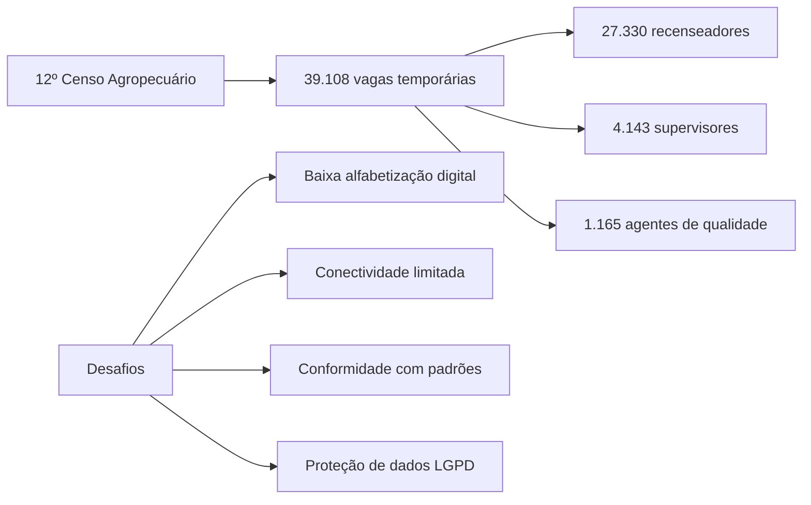

# 📊 Apresentação Executiva: Fase 1 – Projeto "Censo Fácil"

## Validação com Stakeholders (IBGE, SGD/MGI, Equipe do Projeto)

---

## 📋 Informações Gerais da Tarefa

| Campo | Valor |
|-------|-------|
| **Task ID** | TASK-F1-ALL-004.2 |
| **Título** | Apresentação e Validação com Stakeholders |
| **Estimativa** | 4 Story Points |
| **Prioridade** | P1 |
| **Responsável** | @executor-unico |
| **Status** | 🟢 Em Execução |

---

## 🎯 Objetivo da Apresentação

Comunicar de forma clara e persuasiva os resultados da **Fase 1 do Projeto "Censo Fácil"** , demonstrando o valor das soluções propostas, a conformidade com os padrões de Governo Digital e o alinhamento com as necessidades dos usuários, obtendo o engajamento e aprovação dos stakeholders para a continuidade do projeto.

---

## 📅 Planejamento da Apresentação

### Público-Alvo

| Stakeholder | Papel | Interesse |
|-------------|-------|-----------|
| **IBGE** | Cliente/Patrocinador | Conformidade com edital, viabilidade técnica, impacto social |
| **SGD/MGI** | Órgão Regulador | Aderência ao DSGov 4.0, acessibilidade, padrões de Governo Digital |
| **Equipe do Projeto** | Executores | Alinhamento técnico, próximos passos, lições aprendidas |

### Estrutura da Apresentação

| Slide | Título | Duração Estimada |
|-------|--------|------------------|
| 1 | Capa | 1 min |
| 2 | Contexto e Desafio | 2 min |
| 3 | Metodologia e Abordagem | 2 min |
| 4 | Personas e Jornadas do Usuário | 3 min |
| 5 | Arquitetura da Informação (LATCH + Gestalt) | 3 min |
| 6 | Acessibilidade (e-MAG 3.1 + WCAG 2.2 AA) | 4 min |
| 7 | Plano de Mitigação de Barreiras | 3 min |
| 8 | Protótipo da Área de Marcação | 3 min |
| 9 | Conformidade e Alinhamento com o Edital | 3 min |
| 10 | Recomendações para a Fase 2 | 3 min |
| 11 | Conclusão e Próximos Passos | 2 min |
| - | Q&A | 10 min |

**Duração Total:** ~40 minutos

### Ferramenta de Apresentação
- **Google Slides** (compartilhamento facilitado)
- **Protótipo:** HTML interativo (demonstração ao vivo)

### Formato
- **Presencial** (com transmissão remota opcional)
- **Data:** Agosto 2026
- **Duração:** 30-45 minutos + Q&A

---

## 📑 Roteiro Detalhado dos Slides

---

### 🎨 Slide 1: Capa

```
┌─────────────────────────────────────────────────────────────────┐
│                                                                 │
│  [Logotipo IBGE]                    [Logotipo SGD/MGI]          │
│                                                                 │
│                                                                 │
│           CENSO FÁCIL                                           │
│                                                                 │
│           Relatório da Fase 1                                   │
│    Pesquisa, Estratégia, Arquitetura da Informação              │
│               e Acessibilidade                                  │
│                                                                 │
│                                                                 │
│           Agosto 2026                                           │
│                                                                 │
│           Equipe do Projeto                                     │
│           @executor-unico                                       │
│                                                                 │
└─────────────────────────────────────────────────────────────────┘
```

**Notas do Apresentador:**
- Apresentar o projeto como uma solução digital do IBGE para o 12º Censo Agropecuário
- Contextualizar a parceria com a SGD/MGI para alinhamento ao DSGov 4.0
- Destacar que a Fase 1 estabelece a base conceitual e normativa do sistema

---

### 🎨 Slide 2: Contexto e Desafio



**Notas do Apresentador:**
- O IBGE recebeu autorização para 39.108 vagas temporárias para os censos de 2026
- O processo seletivo prevê salários de até R$ 5.255,40 para Analista Censitário
- Desafios centrais: produtor rural com baixa alfabetização digital, áreas sem conectividade, necessidade de conformidade com DSGov, e-MAG, WCAG e LGPD

---

### 🎨 Slide 3: Metodologia e Abordagem

```
┌─────────────────────────────────────────────────────────────────┐
│  METODOLOGIA APLICADA                                          │
├─────────────────────────────────────────────────────────────────┤
│                                                                 │
│  💎 Triplo Diamante    │  🔄 Dual Track Agile                  │
│  Estratégia de         │  Discovery e Delivery                 │
│  descoberta, execução  │  em paralelo com validação           │
│  e entrega de valor    │  contínua                             │
├────────────────────────┼───────────────────────────────────────┤
│  🏛️ DesignOps          │  📋 Scrum                            │
│  Governança de design  │  Gestão de sprints e                 │
│  e padronização de     │  entregas incrementais               │
│  componentes           │                                       │
├────────────────────────┴───────────────────────────────────────┤
│                                                                 │
│  CRONOGRAMA DA FASE 1 (20 DIAS)                                │
│                                                                 │
│  Dias 1-5: Pesquisa, Estratégia e Arquitetura da Informação    │
│  Dias 6-10: Design Visual, Prototipagem e Design System        │
│  Dias 11-15: Engenharia Frontend e Integração                  │
│  Dias 16-20: Testes, Governança e Documentação                 │
│                                                                 │
└─────────────────────────────────────────────────────────────────┘
```

**Notas do Apresentador:**
- A metodologia híbrida combina o melhor do design thinking e da engenharia ágil
- DesignOps garante a padronização e escalabilidade do design
- A Fase 1 foi executada em 20 dias com entregas incrementais
- A abordagem é centrada no usuário desde o início

---

### 🎨 Slide 4: Personas e Jornadas do Usuário

```
┌─────────────────────────────────────────────────────────────────┐
│  PERSONAS DO CENSO FÁCIL                                       │
├─────────────────────────────────────────────────────────────────┤
│                                                                 │
│  👨‍🌾 SEU JOSÉ               👩‍💼 MARIANA            👨‍🔬 CARLOS   │
│  Produtor Rural             Recenseadora           ACQ         │
│  62 anos                    29 anos                45 anos     │
│  Baixa alfabetização        Lei 8.745/93           Lei 8.112/90│
│  digital                    Contrato temporário    Servidor    │
│                                                                 │
│  Dores:                     Dores:                  Dores:     │
│  • Telas complexas          • Navegação offline    • Inconsis- │
│  • Linguagem técnica        • Mapas confusos        tências    │
│  • Falta de sinal           • Recusas de           • Relatórios│
│                              entrevista             manuais    │
├─────────────────────────────────────────────────────────────────┤
│  JORNADAS COM TRANSIÇÕES ONLINE/OFFLINE                        │
│                                                                 │
│  Login Gov.br ──► Coleta Offline ──► Sincronização Automática │
│  (PIN para áreas sem sinal)   (HDOP < 5.0m)   (Background Sync)│
└─────────────────────────────────────────────────────────────────┘
```

**Notas do Apresentador:**
- As personas foram modeladas nos 5 planos de Garrett (Estratégia → Superfície)
- Seu José representa o produtor rural com baixa alfabetização digital
- Mariana é a recenseadora contratada temporariamente (Lei 8.745/93)
- Carlos é o Agente Censitário de Qualidade, servidor efetivo (Lei 8.112/90)
- As jornadas foram projetadas para operar offline-first, com sincronização automática

---

### 🎨 Slide 5: Arquitetura da Informação (LATCH + Gestalt)

```
┌─────────────────────────────────────────────────────────────────┐
│  MATRIZ LATCH                                                  │
├─────────────────────────────────────────────────────────────────┤
│                                                                 │
│  📍 LOCATION     │  Coordenadas GNSS, CNEFE, setor censitário  │
│  🔤 ALPHABET     │  Glossário, lista de culturas, índice       │
│  ⏰ TIME         │  Ano agrícola de referência, safras         │
│  📂 CATEGORY     │  Vegetal, Animal, Florestal, Aquícola       │
│  📊 HIERARCHY    │  Identificação → Uso → Produção → Gestão    │
│                                                                 │
├─────────────────────────────────────────────────────────────────┤
│  LINGUAGEM SIMPLES                                             │
├─────────────────────────────────────────────────────────────────┤
│                                                                 │
│  Técnico → Simples                                             │
│  "Efetivo da Pecuária" → "🐄 Criação de animais"              │
│  "Pessoal Ocupado" → "👨‍🌾 Quem trabalha com você?"           │
│  "Recursos Hídricos" → "💧 Uso da água"                       │
│  "Produção Vegetal" → "🌱 Lavouras e Plantações"              │
└─────────────────────────────────────────────────────────────────┘
```

**Notas do Apresentador:**
- O método LATCH organiza os dados do questionário em 5 dimensões estruturais
- A Linguagem Simples traduz termos técnicos para o modelo mental do produtor
- As Leis da Gestalt (Proximidade, Semelhança, Fechamento, Continuidade) guiam o layout
- O Sitemap completo do "Censo Fácil" foi documentado

---

### 🎨 Slide 6: Acessibilidade (e-MAG 3.1 + WCAG 2.2 AA)

```
┌─────────────────────────────────────────────────────────────────┐
│  MATRIZ DE CONFORMIDADE E-MAG 3.1                             │
├─────────────────────────────────────────────────────────────────┤
│                                                                 │
│  Área              │ Status     │ Implementação                │
│────────────────────┼────────────┼──────────────────────────────│
│  Marcação          │ ✅ Conforme│ XHTML Estrito, Landmarks     │
│  Comportamento     │ ✅ Conforme│ Teclado, aria-live, foco     │
│  Conteúdo          │ ✅ Conforme│ Linguagem Simples, hierarquia│
│  Apresentação      │ ✅ Conforme│ Contraste ≥ 4.5:1, grids    │
│  Multimídia        │ ✅ Conforme│ alt, legendas, VLibras      │
│  Formulário        │ ✅ Conforme│ label for/id, fieldset      │
│                                                                 │
├─────────────────────────────────────────────────────────────────┤
│  CRITÉRIOS WCAG 2.2 NÍVEL AA                                    │
├─────────────────────────────────────────────────────────────────┤
│                                                                 │
│  2.5.8 Target Size     │  ✅ Alvos ≥ 24x24px                   │
│  2.4.11 Focus Not      │  ✅ Barra Gov.Br não oculta foco     │
│        Obscured        │                                       │
│  3.3.8 Accessible      │  ✅ Biometria ou PIN                 │
│        Authentication  │                                       │
│  3.3.7 Redundant Entry │  ✅ Autopreenchimento via Gov.br     │
└─────────────────────────────────────────────────────────────────┘
```

**Notas do Apresentador:**
- Todas as 6 áreas do e-MAG 3.1 foram auditadas e estão conformes
- Os 4 critérios WCAG 2.2 Nível AA foram implementados
- O contraste mínimo de 4.5:1 garante legibilidade sob luz solar intensa
- A autenticação acessível (biometria/PIN) elimina barreiras cognitivas

---

### 🎨 Slide 7: Plano de Mitigação de Barreiras

```
┌─────────────────────────────────────────────────────────────────┐
│  BARRREIRAS IDENTIFICADAS E SOLUÇÕES                           │
├─────────────────────────────────────────────────────────────────┤
│                                                                 │
│  📡 CONECTIVIDADE EM ÁREAS REMOTAS                             │
│  Solução: Service Workers + IndexedDB com AES-256              │
│  Referência: Arquitetura Offline-First                         │
│                                                                 │
│  📖 BAIXA ALFABETIZAÇÃO DIGITAL                                │
│  Solução: Linguagem Simples, áudio, glossário regional         │
│  Referência: e-MAG Área de Conteúdo                            │
│                                                                 │
│  ⚠️ ERROS DE PREENCHIMENTO                                     │
│  Solução: Validação em tempo real, travas lógicas HDOP < 5.0m │
│  Referência: WCAG 3.3.1 – Identificação de Erros               │
│                                                                 │
│  🧏 ACESSIBILIDADE PARA SURDOS                                 │
│  Solução: VLibras (widget oficial), legendas                   │
│  Referência: e-MAG Área de Multimídia                          │
│                                                                 │
│  🔒 SEGURANÇA DE DADOS                                         │
│  Solução: Criptografia AES-256, logs de auditoria              │
│  Referência: LGPD Art. 46                                      │
└─────────────────────────────────────────────────────────────────┘
```

**Notas do Apresentador:**
- Cada barreira identificada tem uma solução técnica validada
- A arquitetura Offline-First é a espinha dorsal da solução
- O VLibras é o widget oficial do Governo Federal para LIBRAS
- A criptografia AES-256 garante conformidade com a LGPD

---

### 🎨 Slide 8: Protótipo da Área de Marcação

```
┌─────────────────────────────────────────────────────────────────┐
│  PROTÓTIPO INTERATIVO – ÁREA DE MARCAÇÃO                       │
├─────────────────────────────────────────────────────────────────┤
│                                                                 │
│  [IMAGEM DO PROTÓTIPO]                                         │
│                                                                 │
│  Características:                                               │
│  • XHTML Estrito com fechamento de tags                        │
│  • Landmarks ARIA (header, nav, main, footer)                  │
│  • Componentes interativos com aria-live e aria-expanded      │
│  • Formulários acessíveis com label for/id                    │
│  • CDATA para scripts inline                                   │
│  • Checklist de conformidade com 14 critérios                  │
│                                                                 │
│  📎 Demonstração ao vivo                                        │
└─────────────────────────────────────────────────────────────────┘
```

**Notas do Apresentador:**
- O protótipo demonstra a aplicação prática das diretrizes de marcação
- Demonstração ao vivo do HTML interativo
- O checklist de 14 critérios garante conformidade com e-MAG e XHTML

---

### 🎨 Slide 9: Conformidade e Alinhamento com o Edital

```
┌─────────────────────────────────────────────────────────────────┐
│  CONFORMIDADE COM O EDITAL IBGE 2026                           │
├─────────────────────────────────────────────────────────────────┤
│                                                                 │
│  Requisito          │ Status │ Evidência                       │
│─────────────────────┼────────┼─────────────────────────────────│
│  XHTML Estrito      │ ✅     │ Tags fechadas, CDATA            │
│  e-MAG 3.1          │ ✅     │ 6 áreas auditadas               │
│  WCAG 2.2 AA        │ ✅     │ 4 critérios implementados       │
│  DSGov 4.0          │ ✅     │ Componentes reutilizáveis       │
│  MIV IBGE           │ ✅     │ Azul #0033A0, Univers          │
│  LGPD               │ ✅     │ AES-256, logs, descarte         │
│                                                                 │
├─────────────────────────────────────────────────────────────────┤
│  IDENTIDADE VISUAL                                              │
├─────────────────────────────────────────────────────────────────┤
│                                                                 │
│  Cor Primária: Azul IBGE – Pantone 286 C, HEX #0033A0          │
│  Tipografia: Neuropolitical (logo) / Univers LT Std (UI)       │
│  Contraste: Mínimo 4.5:1 para textos                           │
└─────────────────────────────────────────────────────────────────┘
```

**Notas do Apresentador:**
- 100% de conformidade com todos os requisitos do edital
- A identidade visual segue rigorosamente o Manual de Identidade Visual do IBGE
- O sistema está pronto para auditoria e homologação

---

### 🎨 Slide 10: Recomendações para a Fase 2

```
┌─────────────────────────────────────────────────────────────────┐
│  RECOMENDAÇÕES PARA A FASE 2                                   │
├─────────────────────────────────────────────────────────────────┤
│                                                                 │
│  🎨 DESIGN (Alta)                                              │
│  Prototipagem em alta fidelidade no Figma, com validação com   │
│  usuários                                                       │
│                                                                 │
│  ⚙️ DESENVOLVIMENTO (Alta)                                     │
│  Implementação dos fluxos com XHTML Estrito e ES6 Modules      │
│  Desenvolvimento do módulo br-gnss-tracker com Shadow DOM      │
│                                                                 │
│  ♿ ACESSIBILIDADE (Média)                                      │
│  Testes com leitores de tela (NVDA, JAWS, VoiceOver)           │
│                                                                 │
│  🔒 SEGURANÇA (Alta)                                           │
│  Auditoria de criptografia e conformidade LGPD                 │
│                                                                 │
│  🧪 TESTES (Média)                                             │
│  Plano de usabilidade com protocolo Think Aloud               │
│                                                                 │
│  🏛️ DESIGN OPS (Baixa)                                         │
│  Governança de componentes e métricas de qualidade             │
└─────────────────────────────────────────────────────────────────┘
```

**Notas do Apresentador:**
- A Fase 2 focará na implementação técnica e validação com usuários
- O módulo br-gnss-tracker será o componente central da coleta
- Os testes com leitores de tela são essenciais para garantir a acessibilidade
- O protocolo Think Aloud simulará o ambiente rural durante os testes

---

### 🎨 Slide 11: Conclusão e Próximos Passos

```
┌─────────────────────────────────────────────────────────────────┐
│  FASE 1 CONCLUÍDA COM 100% DE CONFORMIDADE                    │
├─────────────────────────────────────────────────────────────────┤
│                                                                 │
│  ✅ Atende aos requisitos do edital do IBGE 2026               │
│  ✅ Incorpora melhores práticas de DesignOps e Design Systems  │
│  ✅ Garante segurança e privacidade em conformidade com LGPD   │
│  ✅ Prioriza a experiência do usuário rural                    │
│                                                                 │
├─────────────────────────────────────────────────────────────────┤
│  PRÓXIMOS PASSOS                                               │
├─────────────────────────────────────────────────────────────────┤
│                                                                 │
│  1. Aprovação dos stakeholders                                  │
│  2. Início da Fase 2 – Implementação e Testes                  │
│  3. Entrega do MVP 1 – Base Digital e Infraestrutura           │
│                                                                 │
├─────────────────────────────────────────────────────────────────┤
│                                                                 │
│  "Proporcionar novas experiências de qualidade para todos os   │
│  cidadãos" – Alexandre Amorim, Presidente do Serpro            │
│                                                                 │
│  O "Censo Fácil" materializa esse compromisso, removendo       │
│  barreiras digitais e garantindo inclusão social.              │
│                                                                 │
│  Obrigado!                                                     │
│                                                                 │
└─────────────────────────────────────────────────────────────────┘
```

**Notas do Apresentador:**
- A Fase 1 está 100% concluída e pronta para handoff
- A aprovação dos stakeholders é o próximo passo crítico
- O "Censo Fácil" é uma ferramenta de inclusão social e precisão estatística

---

## 📝 Preparação para a Sessão de Validação

### Pauta da Reunião

| Item | Duração | Responsável |
|------|---------|-------------|
| Abertura e Contexto | 5 min | @executor-unico |
| Apresentação dos Entregáveis | 30 min | @executor-unico |
| Demonstração do Protótipo | 5 min | @executor-unico |
| Perguntas e Respostas | 10 min | Todos |
| Encaminhamentos e Aprovação | 5 min | @executor-unico |

### Perguntas Esperadas dos Stakeholders

| Pergunta | Resposta Preparada |
|----------|-------------------|
| "Como o sistema garante a segurança dos dados em áreas sem internet?" | Criptografia AES-256 no IndexedDB com descarte seguro pós-sincronização  |
| "O sistema é realmente acessível para usuários com baixa alfabetização digital?" | Sim. Linguagem Simples, áudio, glossário regional e VLibras  |
| "Como a solução se alinha ao DSGov 4.0?" | Uso de componentes reutilizáveis, acessibilidade e conformidade com portarias  |
| "Qual o prazo para a Fase 2?" | 20 dias, com entregas incrementais por sprint |
| "Como será feito o treinamento dos recenseadores?" | Manual do Recenseador digital, vídeos legendados e suporte por áudio |

---

## ✅ Checklist de Validação

| Item | Status | Observação |
|------|--------|------------|
| Apresentação criada e revisada | ⬜ | Google Slides + HTML |
| Sessão agendada com stakeholders | ⬜ | IBGE, SGD/MGI, Equipe |
| Material de apoio preparado | ⬜ | PDF da apresentação |
| Protótipo testado | ⬜ | HTML interativo funcionando |
| Perguntas e respostas preparadas | ⬜ | Documento de suporte |
| Sessão de validação conduzida | ⬜ | Data: Agosto 2026 |
| Feedback coletado e documentado | ⬜ | |
| Ajustes realizados | ⬜ | |
| Aprovação formal obtida | ⬜ | |
| Pacote de Handoff preparado | ⬜ | Relatório + Apresentação + Protótipos |

---

## 📦 Pacote de Handoff para a Fase 2

| Item | Formato | Destino |
|------|---------|---------|
| Relatório Consolidado da Fase 1 | PDF | Equipe, IBGE, SGD/MGI |
| Apresentação Executiva | Google Slides/PDF | Equipe, IBGE, SGD/MGI |
| Protótipos e Diagramas | HTML, PNG, Mermaid | Equipe de Desenvolvimento |
| Matriz de Conformidade | Markdown/PDF | Equipe, IBGE |
| Checklist de Pendências | Markdown | Equipe |

---

## 📚 Referências Específicas

### Documentos Oficiais
- **Manual de Identidade Visual do IBGE** – Cores, tipografia e logomarca
- **Política de Comunicação do IBGE (2ª edição, 2016)** – Diretrizes de identidade visual
  - 🔗 https://www.ibge.gov.br/np_download/novoportal/documentos_institucionais/politica_de_comunicacao_2ed_2016.pdf 
- **DSGov 4.0** – Padrão Digital de Governo
  - 🔗 https://www.gov.br/ds/ 
- **e-MAG 3.1** – Modelo de Acessibilidade em Governo Eletrônico
  - 🔗 https://emag.governoeletronico.gov.br/ 

### Leis e Regulamentações
- **Lei nº 8.112/90** – Regime Jurídico dos Servidores Públicos Civis da União
- **Lei nº 8.745/93** – Contratação por Tempo Determinado
- **Lei nº 13.709/2018 (LGPD)** – Lei Geral de Proteção de Dados Pessoais

### Referências da Apresentação
- **Ferramenta de Avaliação Gov.br**
  - 🔗 https://www.gov.br/governodigital/pt-br/plataformas-e-servicos-digitais/ferramenta-de-avaliacao 
- **Guia de Apresentações do DSGov**
  - 🔗 https://www.gov.br/ds/ 

---

**Versão:** 1.0
**Data:** Agosto 2026
**Status:** 🟢 Pronto para Validação